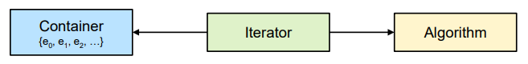
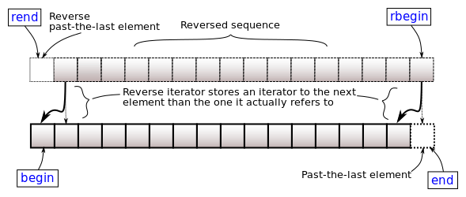
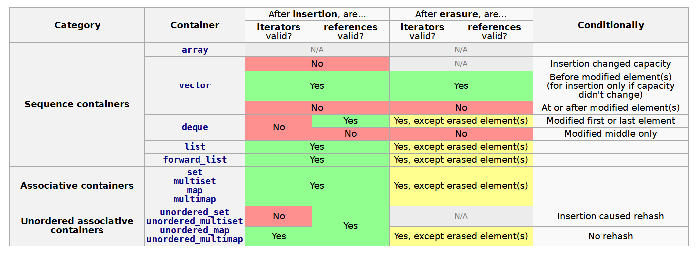

# C++
- [Standard Template Library](#standard-template-library)
  - [Interface](#interface)
  - [Sequence Containers](#sequence-containers)
  - [Utilities???](#utilities)
  - [Ordered Associative Containers](#ordered-associative-containers)
  - [Unordered Associative Containers](#unordered-associative-containers)
  - [Container Adaptors](#container-adaptors)
  - [Iterators](#iterators)
  - [Algorithms](#algorithms)
- [Doubts](#doubts)

## Links <!-- omit from toc -->
- [[CppCon] Classic STL](https://www.youtube.com/watch?v=tXUXl_RzkAk)
- [[CppCon] STL Containers](https://www.youtube.com/watch?v=ZMUKa2kWtTk)

## To Do <!-- omit from toc -->
- [C++ Features (by version)](https://github.com/AnthonyCalandra/modern-cpp-features)
- **Core Language Features:**
  - Object-Oriented Programming:
    - classes & objects
    - encapsulation
    - inheritance
    - polymorphism
    - RAII, rule of 0/3/5
  - Memory:
    - pointers & references
    - dynamic allocations
    - smart pointers
    - casting: static_cast, dynamic_cast, reinterpret_cast, and const_cast
    - misc memory
      - representations
        - sign extension, int promotion
      - fixed vs floating point
      - type qualifiers
      - linkage
      - storage duration
      - storage class
      - endianess
      - memory layout
  - Templates
  - Concurrency
    - threads
    - mutex
    - futures
    - atomics
    - memory ordering
  - Misc:
    - auto
    - ranged for loop
    - bit manipulation
    - lambda
    - move semantics
    - exception & error handling
    - I/O streams
- **STL:**
  - Containers:
    - vector
      - vector of bool
    - string
    - map & unordered map
    - set & unordered set
    - adaptors
  - Algorithms (`<algorithm>`, `<numeric>`):
    - Non-modifying: `std::find`, `std::count`, `std::for_each`, `std::all_of/any_of/none_of`
    - Modifying: `std::transform`, `std::copy`, `std::fill`, `std::replace`, `std::remove`
    - Sorting & searching: `std::sort`, `std::binary_search`, `std::lower_bound/upper_bound`
    - Min/Max: `std::min`, `std::max`, `std::minmax_element`
    - Numeric: `std::accumulate`, `std::reduce`, `std::inner_product`
  - Iterators

## Standard Template Library
- **Containers:** essentially data structures that stores templated elements
  - **Sequence:** elements' position dictated by user
  - **Associative:** elements stored in a way that allows fast look-up
    - can be ordered (sorted) or unordered (hashed)
    - ordered containers implemented using binary balanced search trees
  - **Adaptors:** different interface to underlying sequence containers
- **Algorithms:** functions that operate on elements stored in containers using iterator-range
- **Iterators:** general way to access elements in containers
  

### Interface
- **Constructors:**
  |          |                                              |
  | -------- | -------------------------------------------- |
  | default  | `std::vector<int> vec`                       |
  | count    | `std::vector<int> vec(size)`                 |
  | range    | `std::vector<int> vec(vec2.begin, vec2.end)` |
  | copy     | `std::vector<int> vec(vec2)`                 |
  | move     | `std::vector<int> vec(std::move(vec2)`       |
  | sequence | `std::vector<int> vec{1, 2, 3, 4, 5}`        |
- **Removing Elements:**
  |                              |                                                    |
  | ---------------------------- | -------------------------------------------------- |
  | clear all elements           | `vec.clear()`                                      |
  | erase element in position    | `vec.erase(itr)`                                   |
  | erase all elements of value  | `std::erase(vec, 5)`                               |
  | erase if predicate satisfied | `std::erase_if(vec, [](auto i) { return i >= 3 })` |
- **Size:**
  |                    |                  |
  | ------------------ | ---------------- |
  | empty?             | `vec.empty()`    |
  | number of elements | `vec.size()`     |
  | capacity           | `vec.capacity()` |
- **Assignment & Swap:**
  |                   |                         |
  | ----------------- | ----------------------- |
  | copy assign       | `vec = vec2`            |
  | move assign       | `vec = std::move(vec2)` |
  | initialize assign | `vec = {1, 2, 3, 4, 5}` |
  | swap API          | `vec.swap(vec2)`        |
  | swap Algorithm    | `std::swap(vec, vec2)`  |
- **Comparison:** first size compared, then elements compared one-by-one
  - all containers support `==` & `!=`
  - only sequence & ordered containers support `<`, `<=`, `>` & `>=`
    - result determined by first mismatched element pair
- **Range-Based Loop:**
  ```cpp
  for (const auto i : vec) {
      std::cout << i << " ";
  }
  ```

### Sequence Containers
- **Overview:**
  |                       | array              | vector               | deque                   | list                   | forward_list     |
  | --------------------- | ------------------ | -------------------- | ----------------------- | ---------------------- | ---------------- |
  | header                | `<array>`          | `<vector>`           | `<deque>`               | `<list>`               | `<forward_list>` |
  | size                  | static             | dynamic              | dynamic                 | dynamic                | dynamic          |
  | implementation        | static array       | dynamic array        | sequence of arrays      | doubly-LL              | singly-LL        |
  | access                | random             | random               | random                  | forward & backward     | forward          |
  | optimized for         |                    | end `O(1)`           | begin & end `O(1)`      | begin & end `O(1)`     | begin `O(1)`     |
  | memory reserve        |                    | yes                  | no (not useful)         | no                     | no               |
  | memory release        |                    | `shrink_to_fit()`    | `shrink_to_fit()`       | always                 | always           |
  | iterator invalidation |                    | yes                  | yes                     | no                     | no               |
  | strength              | stack, no overhead | 95% solution         | insert/delete begin/end | insert/delete anywhere | no overhead      |
  | weakness              | fixed size         | `O(n)` insert/delete | `O(n)` insert/delete    | no random access       | no random access |
- **Aggregate Initialization:**
  ```cpp
  std::array<int, 10> arr          // elements not initialized
  std::array<int, 10> arr{}        // elements default initialized
  std::array<int, 10> arr{1, 2, 3} // remaining elements default initialized
  ```
- **Special Elements:**
    ```cpp
    vec.front() // first element
    vec.back()  // last element
    ```
- **Index Access:**
  ```cpp
  vec[i]    // bounds not checked
  vec.at(i) // bounds checked
  ```
- **Insert vs Emplace:**
  - temporary object created then copy/move into container
    ```cpp
    vec.insert(pos_itr, initializer_list) // insert at position
    vec.push_back(initializer_list)       // insert at back
    ```
  - object ctor in container memory, more performant if move ctor inefficient
    ```cpp
    vec.emplace(pos_itr, initializer_list)      // similar to insert
    vec.emplace_back(pos_itr, initializer_list) // similar to push_back
    ```
- **List Special Functions:** optimized for pointer manipulation
  - ```cpp
    lst.sort()                                                   // sort elements
    lst.merge(another_lst)                                       // merge sorted lists
    lst.unique()                                                 // remove consecutive duplicate elements
    lst.reverse()                                                // reverse order of elements
    lst.splice(another_lst_itr, another_lst, start_itr, end_itr) // move elements between iterator range
    ```
  - `forward_list` only stores pointer to next element, so only next can be modified
    ```cpp
    fwd_lst.erase_after(itr)                                       // similar to erase
    fwd_lst.insert_after(itr, val)                                 // similar to insert
    splice_after(another_lst_itr, another_lst, start_itr, end_itr) // similar to splice
    ```
- **`vector<bool>`:** space-efficient specialization where each element occupies single bit
  - different elements in same container shouldn't be concurrently modified
  - `flip()` toggles each element (bit)
- **Misc:**
  - prefer `array` over `vector` when size known compile-time or is small (need to fit on stack)
  - `std::string` is just `std::vector<char>` with special operations like `+=`
  - `vector` capacity change leads to new allocation and copying of existing data
  - `deque` comes from **d**ouble **e**nded **que**ue
  - `deque` doesn't need data relocation when resized, so no memory reservation
  - `forward_list` doesn't know its size, instead use `std::distance(f_list.begin(), f_list.end())`
  - all search `O(n)` but constant factor high for list due to low spatial locality
  - linked-lists are better with large elements to avoid copying (only pointer re-assigned)

### Utilities???

### Ordered Associative Containers
- **Declaration:**
  ```cpp
  template <class Key,
            class T,
            class Compare = std::less<Key>,
            class Allocator = std::allocator<std::pair<const Key, T>>>
  class map;
  ```
- **Overview:**
  |          | header  | value associated | identical keys |
  | -------- | ------- | ---------------- | -------------- |
  | set      | `<set>` | no               | no             |
  | multiset | `<set>` | no               | yes            |
  | map      | `<map>` | yes              | no             |
  | multimap | `<map>` | yes              | yes            |
- **Insert:**
  ```cpp
  <pos_itr, bool> = set.insert(val)   // insert value if not exists (check bool)
  pos_itr = set.insert(hint_itr, val) // pass hint for `θ(1)` insertion
  ```
  - for multi-* duplicates permitted, so only iterator returned 
- **Find:**
  ```cpp
  pos_itr = st.find(key) // find element, (pos_itr == st.end()) if not present
  if (mp.count(key) > 0) // number of matching keys (0/1 for set & map)
  ```
- **Misc:**
  - `[]` operator creates new element (with default-constructed value) if key already not present

### Unordered Associative Containers
- **Declaration:**
  ```cpp
  template <class Key,
            class Hash = std::hash<Key>,
            class KeyEqual = std::equal_to<Key>,
            class Allocator = std::allocator<Key>>
  class unordered_map;
  ```
- properties overview similar to ordered associative containers
- **Bucket Interface:**
  ```cpp
  size_t bc = ust.bucket_count() // total number of buckets
  float lf = ust.loadfactor()    // average elements per bucket, size()/bucket_count()
  size_t bct = ust.bucket(val)   // bucket number of value
  ```

### Container Adaptors
- **Overview:**
  |                |           |                                                               |
  | -------------- | --------- | ------------------------------------------------------------- |
  | stack          | `<stack>` | deque wrapper with push/pop from only one side (LIFO)         |
  | queue          | `<queue>` | deque wrapper with push on one side & pop on other (FIFO)     |
  | priority queue | `<queue>` | (sorted) vector wrapper with `O(1)` top-element lookup (heap) |
- **Interface:**
  |                                | stack               | queue               | priority queue                    |
  | ------------------------------ | ------------------- | ------------------- | --------------------------------- |
  | copy ctor (existing container) | `stack<T> stk(dq)`  | `queue<T> qu(dq)`   | `priority_queue<T> pq(pred, vec)` |
  | push new element               | `push(val)`         | `push(val)`         | `push(val)` (into sorted vec)     |
  | peek top element               | `top()`             | `front()`           | `top()`                           |
  | pop top element                | `pop()`             | `pop()`             | `pop()`                           |
  | misc                           | `empty()`, `size()` | `empty()`, `size()` | `empty()`, `size()`               |
- **Misc:**
  - `pop()` doesn't return element, so store `top()`/`front()` first
  - `stack` & `queue` use deque since growing is faster  
    `priority_queue` uses sorted vector since insertion faster with contiguous memory
  - use `std::less<T>` (largest at top) or `std::greater<T>` as predicate

### Iterators
- **Types:**
  | type           | properties                                           | example                         |
  | -------------- | ---------------------------------------------------- | ------------------------------- |
  | output         | write-only, forward traversal, single pass           | output stream                   |
  | input          | read-only, forward traversal, single pass            | input stream                    |
  | forward        | read/write, forward traversal, multi-pass            | `forward_list`, `unordered_set` |
  | bi-directional | forward & backward traversal                         | `list`, `set`                   |
  | random-access  | arbitrary position `O(1)` jumps, pointer arithematic | `vector`, `array`               |
  - `unordered_set` elements in same bucket stored as `forward_list`
- **Hierarchy of Requirements:** lower category supports all operations of ones above it (output optional)  
  *example:* bi-directional supports read/write & multi-pass (forward's properties)
  ```mermaid
  graph BT
    random[Random Access]
    bidirectional[Bi-Directional]
    forward[Forward]
    input[Input]
    output[Output]

    random --> bidirectional
    bidirectional --> forward
    forward -.-> output
    forward --> input
  ```
- **Iterator Range:** represented by pair of iterators `[start, end)`
  - `last` is non-dereferencable, "one-past-the-end" (PTE) position
  - use empty (sentinel) nodes as PTE for node-based containers
- **Interfaces:**
  - `begin()` & `end()` iterators common to all containers
  - `rbegin()`, `rend()` reverse iterators for bi-directional containers
  - 
- **Iterator Invalidation:**  
 
- **Misc:**
  - `adv_itr = std::next(itr, val)` advance iterator specific number of positions
  - algorithms requiring `O(1)` access (like `std::sort`) need random-access iterator
  - `auto dist = std::distance(itr1, itr2)` returns number of hops, but return type `std::ptrdiff_t` (signed int)
  - output iterators have no concept of end, so no `==` or `!=` operators

### Algorithms
- **Types:**
  - **Non-Modifying:** searching, counting, min, max
  - **Modifying:** change value of elements
  - **Removing:** removing elements from sequence (usually by moving removed elements to end)
  - **Mutating:** change order of elements, reverse, rotate, shuffle, permute
  - **Sorting:**
  - **Sorted-Range:**
  - **Numeric:**
- `lower_bound()` `O(log n)` with random-access iterators, else `O(n)`

## Doubts
- C-style arrays decay to pointer when passed to function
- when to use curly brace initializer & when to use parantheses?
  ```cpp
  std::string str("hello world");
  std::array<uint32_t, 3> arr{1, 2, 3};
  ```
- all containers table with `O()` for common operations & when to use
  - in Algorithms?