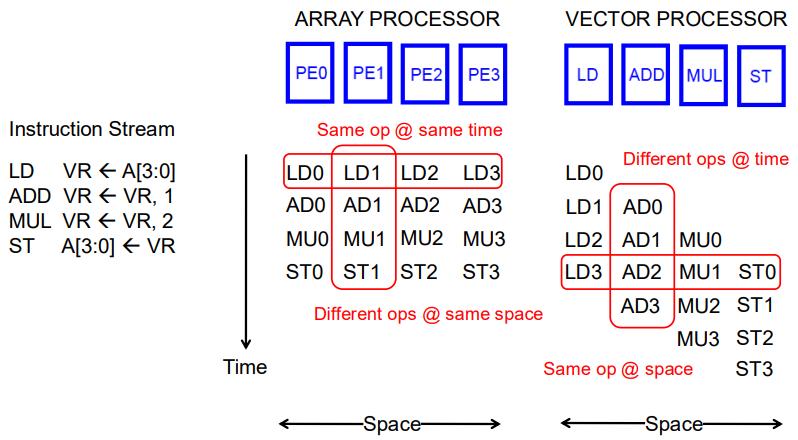
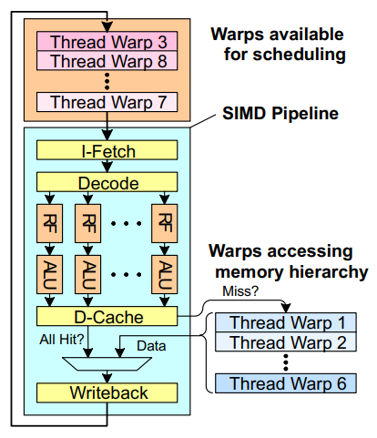
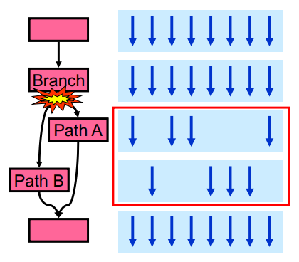
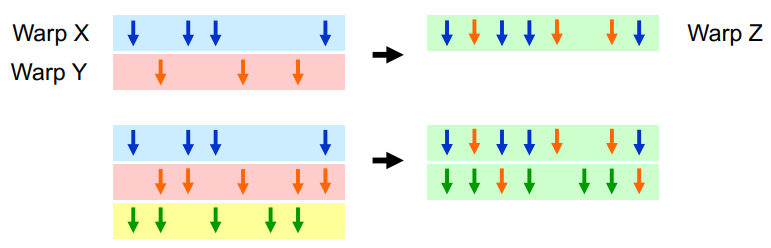
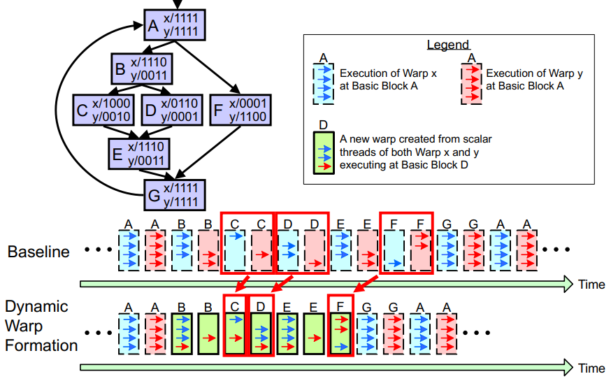
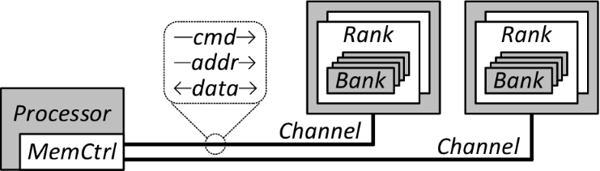
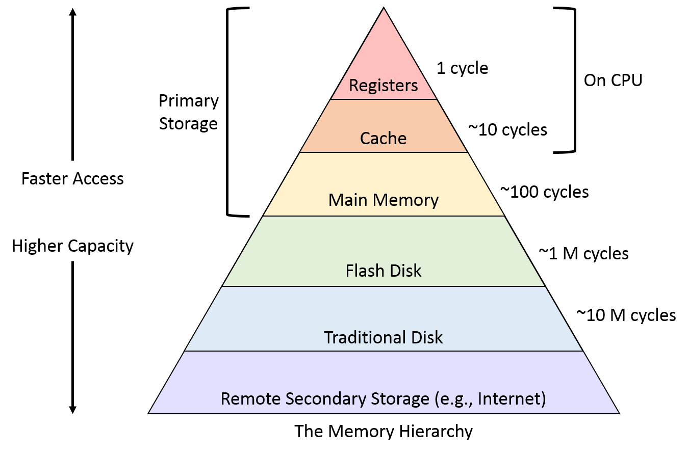

# Computer Architecture
- [Introduction](#introduction)
- [Instruction Set Architecture](#instruction-set-architecture)
- [Pipelining](#pipelining)
- [Out-of-Order Execution](#out-of-order-execution)
- [Superscalar Execution](#superscalar-execution)
- [Very-Long Instruction Word](#very-long-instruction-word)
- [Systolic Arrays](#systolic-arrays)
- [Decoupled Access Execute](#decoupled-access-execute)
- [Fine-Grained Multithreading](#fine-grained-multithreading)
- [Branch Prediction](#branch-prediction)
- [Single Instruction Multiple Data](#single-instruction-multiple-data)
- [Graphics Processing Unit](#graphics-processing-unit)
- [Memory](#memory)
  - [Cache](#cache)
  - [multi core caches](#multi-core-caches)
- [prefetching](#prefetching)
- [Parallel Computing](#parallel-computing)
- [Misc](#misc)
- [Scratch](#scratch)

## Links <!-- omit from toc -->
- [Design of Digital Circuits (ETH, 2018)](https://www.youtube.com/playlist?list=PL5Q2soXY2Zi_QedyPWtRmFUJ2F8DdYP7l)
- [Parallel Computing (Stanford, 2023)](https://www.youtube.com/playlist?list=PLoROMvodv4rMp7MTFr4hQsDEcX7Bx6Odp)

## To Do <!-- omit from toc -->

## Introduction
- **Abstraction:** higher level only needs to know about interface to lower level, not how its implemented
- **Moore's law:**
  - observation of historical trend that transistor density doubles approximately every two years
  - smaller transistors allowed higher clock speed and more complex instruction-level-parallelism features
  - clock `f ∝ V` volatage and power `p = f * V^2`, so `p ∝ f^3`
  - practically general-purpose instruction streams (due to data dependencies & branches) rarely sustain more than 4 instructions-per-cycle
  - so now focus on parallelism (multi-core) and specialization (NPUs, ISPs)
- **Iron Law of Performance:** `num_instructions * cycles_per_instruction x clock_cycle_time` gives time taken to execute a program

## Instruction Set Architecture
- **Von-Neumann Model:** instruction & data kept in same memory and share a single bus  
  **Harvard Model:** having separate instruction & data memory and buses, can fetch instruction & data at the same time  
  modern processors use both Von-Neumann (RAM holds everything) and Harvard (separate I & D caches)
- **Data-Flow Model:**
  - instruction fetched & executed only when its input operands are ready
  - no instruction pointer required
- **Register:**
  - high speed internal storage to hold operands & results from the ALU
  - typically one register contains one word
  - **Register File/Set:** set of registers that can be manipulated by instructions  
    *example:* ARMv7-A has `32 x 32bit` registers
- **Special Purpose Registers:**
  - **Stack Pointer (`SP`):** address of top of the stack
  - **Link Register (`LR`):** return address
  - **Instruction Register (`IR`):** current instruction
  - **Program Counter (`PC`) / Instruction Pointer (`IP`):** address of next instruction to be fetched
  - **Program Status Register (`PSR`):** zero (`Z`), negative (`N`), carry (`C`), overflow (`V`)
  - **Memory Address Register (`MAR`):** address to read/write
  - **Memory Data/Buffer Register (`MDR`/`MBR`):** data coming from read or to be written
    - to read data: source address → `MAR`, then wait for data → `MDR`
    - to write data: destination address → `MAR` and data → `MDR`, then trigger "write enable" signal
- **Instruction Set Architecture (ISA):**
  - abstract interface that defines how software interacts with the hardware
  - specifies memory organization, register set and instruction set (opcodes, data types & addressing modes)
  - **Instruction:** fundamental unit of execution, made up of opcode & operands
  - ISA can have large or small set of opcodes
    - CISC: do more per instruction, but needs complex hardware
    - RISC: simpler & faster instructions, but shifts burden of optimization to compiler
  - **Semantic Gap:** how closely instructions map to high-level language constructs  
    *example:* instructions that work on matrix directly lead to smaller semantic gap
- **Instruction Cycle:**
  - sequence of steps that instruction goes through to be executed
  - not all six steps are required for each instruction  
    *example:* `ADD R0, R1, R2` doesn't need to evaluate address
  - **Fetch:** obtain instruction from memory (via `PC`) and load it into `IR`
  - **Decode:** translate the opcode to detemine the operation
  - **Evaluate Address:** computes memory locations of operands
  - **Fetch Operands:** retreive operands from registers or memory
  - **Execute:** perform actual computation or logic
  - **Store Result:** write output to destination
- **Micro-Architecture:**
  - hardware-specific implementation of ISA, which keeps improving while maintaining constant ISA interface  
    *example:* `add` instruction vs underlying adder implementation
  - hardware may execute instructions in any order, final results visible according to ISA semantics
  - enables hardware features like pipelining, speculative execution, OoO execution without any SW changes
- **Architectural State:**
  - specific hardware components that represent current state of a program as defined by ISA
  - *example:* `PC`, register file, memory
- 
  | Single Cycle Machine                        | Multi-Cycle Machine                                              |
  | ------------------------------------------- | ---------------------------------------------------------------- |
  | exactly 1 clock cycle per instruction       | multiple cycles as needed                                        |
  | architectural state updated after execution | internal state during processing, architectural state at the end |
  | cycle time dictated by slowest instruction  | need extra registers to store intermediate results               |

## Pipelining
- **Pipelining:**
  - with multi-cycle design, some hardware resources are idle during different phases of instruction processing cycle
  - so assembly-line processing of instructions for higher instruction throughput (`throughput ∝ num_stages`) and better hardware utilization
  - 
  - **Steady State:** when the pipeline is full and throughput is 1 instruction/cycle
- **Dependencies:**
  - one instruction relies on the results or resources of a previous one
  - **Structural:** two instructions in the pipeline need the same hardware at the exact same time  
    can be eliminated by duplicating hardware resources
  - **Data:** current instruction needs previous instruction to complete
    - **Read-after-Write:** true dependency on previous instruction's output value  
      *a.k.a.* true dependency
    - **Write-after-Read** & **Write-after-Write:** dependency on a register name only not on value due to limited num registers  
      exists due to lack of register IDs (*i.e.* names), *a.k.a.* false dependencies
    - 
      ```cpp
      // RAW
      r3 = r1 * r2;
      r5 = r3 + r4; // must wait for r3 to be computed

      // WAR
      r3 = r1 * r2;
      r1 = r4 + r5; // must not overwrite "r1" before it is read

      // WAW
      r3 = r1 * r2;
      r3 = r4 + r5; // must not overwrite "r3" till multiply done
      ```
  - **Control:** next instruction known only once branch is evaluated  
    *i.e.* data dependency on the instruction pointer (`IP`/`PC`)
- **Interlocking:**
  - detection of dependence between instructions to guarantee correct execution
  - **HW-based (Stall):** dependent instruction stalled (`NOP`s into next stage) until its source data is ready
  - **SW-based (Bubble):** compiler inserts `NOP`s to ensure stalled instruction waits
  - *example:* purple instruction delays execution  
    
- **Data Forwarding/Bypassing:**
  - supply data directly from internal pipeline registers to the ALU, bypassing the register file
  - resolves most RAW dependencies without stalls (cannot solve use-after-`load` hazards)
- **Precise:** maintain consistent architectural state where all preceding instructions have retired/committed their results, and no subsequent instructions have modified the state (*i.e.* original program order)  
  **note:** required for exception handling, and useful for debugging

## Out-of-Order Execution
- to maximize throughput, independent instructions may overlap long-latency operations  
  but they precise architectural state must be maintained
- **Re-Order Buffer:**
  - instructions execute & complete out-of-order but results are buffered in ROB
  - results committed in-order (ROB → register file) when oldest instruction has completed without exceptions
  - 
  - *example:* ROB execution for independent operations
    
- **ROB with Data Dependencies:**
  - operands are sourced from register file, reorder buffer or directly via bypass path
  - **Register Renaming:** register mapped to ROB entry of (pending) instruction which will provide the data
  - instruction upon completion broadcasts its result to every instruction waiting for that ROB entry
  - since ROB (unlike register file) is not constrained by ISA, it can be very large, thus eliminating false (WAW & WAR) dependencies
  - true (RAW) dependency will still stall the in-order pipeline
- **Out-of-Order Execution:**
  - move dependent instructions out of the way of independent ones, ensuring true data dependency does not stall the entire processor
  - dependent instructions moved into rest areas (reservation stations), while monitoring their source values (or HW freeing up)
    instruction dispatched from rest areas when all source values are available
  - *i.e.* instructions dispatched in dataflow order, but not exposed to ISA
  - tolerates long-latency operations (like memory) by concurrently executing independent operations
  - *a.k.a.* dynamic instruction scheduling
- **Instruction/Scheduling Window:**
  - all decoded but not yet retired instructions
  - data-flow graph limited to this window is dynamically built
- ***Example:* Tomasulo's Algorithm:**
  - assign tag (register renaming) if dependency exists, else read value directly
  - buffer instruction (with tag and/or data values) to functional unit's RS
  - wait for data/resource dependencies to resolve, wakes up once its required tag is broadcasted
  - completed results & tags are broadcasted to all waiting RS entries and stored in ROB
  - register file only updated when instruction retires from ROB
  - 
- **Memory Dependency Handling:**
  - memory address (& dependency) un-known until address computation is done
  - **Memory Disambiguation Problem:** challenge of determining whether two memory operations refer to the same physical address when they are executed out-of-order
  - approaches:
    - **Conservative:** load stalled till all prior stores are resolved
    - **Speculative:** load executes immediately assuming no conflict  
      but if store calculates same address, pipeline later flushed
  - **Store-to-Load Forwarding:** stores are buffered (for burst writes) before committing to cache/memory, subsequent load can intercept data from store buffer directly  
    *i.e.* data forwarding/bypassing of memory

## Superscalar Execution
- **Superscalar Execution:**
  - hardware automatically identifies & dispatches independent instructions to multiple execution units simultaneously
  - `N`-wide superscalar capable of sustaining peak thoughput of `N` IPC
  - superscalar & out-of-order execution are orthogonal concepts  
   *i.e.* can have all four combinations of processors: [in-order, out-of-order] x [scalar, superscalar]
- **Dependency Checking:**
  - hardware ensures that instructions fetched in the same cycle are independent of each other
  - OoO execution only has dependency checks across different pipeline stages  
    superscalar additionaly has checks between concurrent instructions in the same pipeline stage at the same time

## Very-Long Instruction Word
- **Very-Long Instruction Word (VLIW):**
  - multiple independent instructions packed/bundled together by the compiler
  - simple hardware which needs no dependency checking  
    compiler takes care of finding instruction level parallelism
  - execution of instructions in the bundle guaranteed to be atomic
  - recompilation required when execution width (`N`) or functional units change
- **Example: Qualcomm Hexagon DSP:**
  - each core can process 4 instructions concurrently
  - some VLIW slots are specialized, *example:* load/store only in first two slots
  - 

## Systolic Arrays
- **Systolic Array:**
  - grid of processing elements (nodes) that rhythmically compute and pass data
  - each node independently computes a partial result based on data received from its upstream neighbours, stores the result within itself and passes it downstream
  - maximizes computation done on a each piece of data brought from memory
  - 
- **Example: Google Tensor Processing Units:**
  - fixed weights are pre-loaded into nodes, reducing power-hungry memory access
  - each node performs a multiply-accumulate every clock cycle
  - **Horizontal Move:** input data enters from the left, multiplied by the weight, and un-modified data passed to the right
  - **Vertical Accumulation:** multiplication results added to incoming partial sums from above, then passed downward
    *i.e.* `new_partial_sum = (input_data * fixed_weight) + partial_sum_from_above`
  - 
  - todo: use a different GIF like from [this](https://www.youtube.com/watch?v=tMYC0ykA82A)

## Decoupled Access Execute
- **Decoupled Access Execute:**
  - decouple operand access from execution by (compiler) splitting them into two independent instruction streams  
    synchronization between two streams is only required when handling branch instructions
  - access unit: address calculation and data fetching from memory  
    execute unit: processing operands pulled from data queue
  - access stream typically runs ahead of the execute stream  
    *i.e.* pre-fetching data to hide memory latency
  - enables limited OoO execution with much simpler hardware
  - 

## Fine-Grained Multithreading
- **Fine-Grained Multithreading:**
  - fetch-engine fetches instruction from a different thread every cycle  
    *i.e.* no two instructions from a thread is the pipeline concurrently
  - hardware maintains multiple thread contexts (`PC` + registers)
  - tolerates dependency latencies by overlapping it with useful work from other threads
  - maximized throughput but degrades single thread performance (one instruction fetched every `N` cycles)
  - 

## Branch Prediction
- **Branch Problem:** next fetch-address unknown until control-flow instruction is resolved several cycles later in the pipeline
- **Branch Penalty:** number of speculatively executed instructions that must be discarded in case of branch mis-prediction
- **Branch Prediction:**
  - guess the direction of a branch and target address before the branch instruction is actually executed
  - **Static:**
    - guess is fixed at compile time
    - naive implementations like always not-taken and always taken
    - heuristics based implementations like profile (run) based and program (code) analysis based  
      *example:* `nullptr` check rarely true
  - **Dynamic:**
    - hardware guesses based on dynamic information collected at runtime
    - **1-Bit Predictor:**
      - guess branch will take same direction as its last instance
      - *example:* mispredicts last iteration for loop branches
    - **2-Bit Predictor:**
      - add hysteresis to one-bit predictor so that the prediction does not change on a single different outcome
      - *i.e.* needs 2 opposing outcomes to flip prediction direction
      - 
    - **Branch History Predictor:**
      - **Local:** strictly based on that specific instruction's past direction
      - **Global:** based on previous different branches' outcome assuming correlation  
        *example:* both conditions correlated
        ```cpp
        if (x < 1) { ... }
        if (x > 1) { ... }
        ```
      - 
- **Delayed Branching:** compiler inserts instructions executed regardless of branch direction immediately after control instruction
  ```cpp
  // base
  ADDI R1, R1, 1;
  BEQ R2, R3, LABEL;
  NOP; // delay slot

  // optimized
  BEQ R2, R3, LABEL;
  ADDI R1, R1, 1; // moved to delay slot
  ```
- **Loop Un-Rolling:**
  - replicate loop body multiple times to increase work done per iteration
  - reduces loop control logic and increases instruction-level parallelism (more independent instructions)  
    increase in binary size which increases instruction cache misses
- **Predicated Execution:**
  - compiler converts control dependency to data dependency
  - instruction result committed only if predicate passes, else similar to `NOP`
  - *example:* remove branch using conditional move (`CMOV`)
    ```cpp
    if (a == 5) {
      b = 4;
    } else {
      b = 3;
    }

    CMPEQ condition, a, 5;
    CMOV condition, b, 4;
    CMOV !condition, b, 3;
    ```

## Single Instruction Multiple Data
- **Flynn's Taxonomy of Computers:**
  - **SISD:** *example:* single core processor
  - **SIMD:** *example:* array & vector processor
  - **MISD:** *example:* systolic array processor
  - **MIMD:** *example:* multi-core processor

- **Regular Parallelism:** operations are performed on structured data (like array, matrix) with predictable access patterns  
  *example:* matrix multiplication  
  **Irregular Parallelism:** operations on unpredictable data structures (like graphs, sparse matrices)  
  *example:* graph processings
- **Data Parallelism:** same operation performed across different pieces of data  
  SIMD hardware exploits regular data parallelism
- **Time-Space Duality:**
  - 
  - **Array Processor:** multiple data elements processed at the same time across different hardware units
  - **Vector Processor:** multiple data elements processed in consecutive time steps using the same hardware unit via pipelining
- **Vector Instructions ⇒ Deeper Pipelines:**
  - no intra-vector dependencies
  - no control flow within a vector
  - fixed stride makes address calculation easy, and even enables prefetching
- practically vector machine performance is limited by (sequential) scalar operations  
  so a powerful vector machine needs a powerful scalar processor as well  
  > if you were plowing a field, which would you rather use: two strong oxen or 1024 chickens?
- **Masked Operations:** handle conditional branches by enabling/disabling operations on a per-lane basis  
  todo: HVX example in performance.md
- **Vector Stripmining:**  if num elements exceeds hardware vector length, then process it in vector length sized "strips"  
  process remaining elements that don't fill a complete vector using scalar loop or masked operation
- **Scatter/Gather Operations:** handle non-contiguous (& non-strided) memory patterns by using indirection to move data between memory and vector registers  
  uses base address and index array (offsets) to generate the addresses

## Graphics Processing Unit
- **Single Program Multiple Data (SPMD):**
  - multiple threads (processing elements) execute the same program (kernel) but on different pieces of data
  - threads in same block can synchronize at certain points in program using barriers
  - **Warp/Wavefront:** dynamic grouping of threads that execute same instruction (*i.e.* SIMT)  
    *i.e.* dynamic SIMD formed by hardware which is not exposed to the programmer
- **FGMT of Warps:** switches between different warps every clock cycle to hide latencies (like cache miss, data load)  
  
- **SIMD utilization:** fraction of SIMD lanes executing a useful
operation
- **Warp Control Flow Problem:**
  - threads within a warp can take different control flow paths but they need to have a common `PC`
  - executing both paths for all warps reduces SIMD utilization (lanes executing useful operation)
  - 
- **Dynamic Warp Formation/Merging:**
  - find individual (waiting) threads that are at the same `PC` and dynamically group them together into a single warp
  - 
- ***Example:* Dynamic Warp Formation:**  
  

## Memory
- **Memory Interleaving/Banking:**
  - divide large monolithic memory array into smaller arrays that can operate independently
  - *example:* DRAM interleaved into channel → rank → bank  
    if each bank gives 1bit per cycle, total throughput is `num_banks x num_ranks x num_channels`  
    
- 
  | ideal memory             | practical memory                   | comment                                  |
  | ------------------------ | ---------------------------------- | ---------------------------------------- |
  | zero access time latency | faster is more expensive           | SRAM vs DRAM                             |
  | infinite capacity        | bigger is slower                   | longer to determine the location         |
  | zero cost                |                                    |                                          |
  | infinite bandwidth       | higher bandwidth is more expensive | more banks, more ports, higher frequency |
- **Memory Hierarchy:**
  - tiered organization of memory types where speed and cost are balanced against capacity
  - fundamental tradeoff is small (costly) fast memory vs (slow) large slow memory
  - ensures that frequently used data is kept in high-speed levels
  - 

### Cache
- **Locality of Reference:** 
  - tendency of a program to access same set of memory locations repetitively over a short period of time
  - **Temporal:** re-use of specific data within a relatively small time duration  
    *example:* variable in a loop
  - **Spatial:** use of data elements within relatively close storage locations  
    *example:* array traversal
  - temporal is locality in time, while spatial is locality in space
- **Cache:** small high-speed memory buffer that stores copies of data from frequently used main memory locations
- **Cache Management:**
  - **Automatic:** hardware handles data movement across levels  
    *example:* processor L1/L2/L3 caches
  - **Manual:** programmer controlled buffers  
    *example:* on-chip scratchpad memory
- **Cache Line/Block:** smallest unit of data that can be transferred between main memory & cache
- **Hit:** requested data found in cache (typically L1)  
  **Miss:** fetch cache line from lower level (L2, L3, RAM), leads to miss penalty stall cycles
- **Cache Hit Rate:** `(num_hits) / (num_hits + num_misses) = (num_hits) / (num_accesses)`  
  **Average Memory Access Time:** `(hit_rate x hit_latency) + (miss_rate x miss_latency)`
- **cache design decisions:**
  - **placement:** where and how to place/find a block
  - **replacement:** what data to remove to make room
  - **granularity of management:** large or small blocks, maybe sub-blocks
  - **write policy:** what do we do about writes
  - **instruction/data:** do we treat them separately
- when address arrives to cache for read, in parallel address sent to:  
**tag store:** check if the address is present in the cache and returns hit/miss, also has some bookkeeping information for replacement/eviction  
**data store:** stores memory blocks, returns memory, discard data if tag store returns miss  
[](./media/computer_architecture/cache_tag_data_store.png)  
- **cache addressing:** main memory is logically divided into fixed-size chunks (blocks)  
cache can only house limited number of blocks so each block address maps to a potential location in the cache determined by the index bits in the address, these are used to index into the tag & data stores  
[](./media/computer_architecture/cache_index_bits.png)  
- **cache access:**  
[](./media/computer_architecture/cache_access.png)
  - index into the tag and data stores with index bits in address
  - check valid bit in tag store and compare tag bits in address with stored tag in tag store
  - if the stored tag is valid and matches the tag of the block then it is a cache hit
  - block in data store valid, get the required word from block using mux
- **cache mapping:** how a certain block that is present in the main memory gets mapped to the memory of a cache in the case of any cache miss  
**associativity:** how many blocks can map to the same index, blocks that map to the same index are called set  
[](./media/computer_architecture/cache_associativity.png)
  - **direct mapped:** a given main memory block can be placed in only one possible cache location  
  if the location is previously taken up then the new block is loaded after evicting old block, so two blocks that map to the same index cannot be present in the cache at the same time so can cause conflict misses  
  example: can lead to 0% hit rate if same block accessed in interleaved manner
  - **fully associative:** a block can be placed in any cache location, don't have conflict misses instead has capacity misses
  - **k-way set associative:** a given main memory block can be placed in any of the `k` cache locations (`k`-way associative)  
  trade-off between direct-mapped cache (less complex) and fully associative cache (fewer misses)  
  direct mapped is an extreme case with `k==1`  
  diminishing returns for higher associativity as it will lead to higher hit rate but also slower cache access time (longer tag search) and more expensive hardware (more comparators)
- think of each block in set having a priority indicating how important it to keep the block in the cache then there are three key decisions within a set to determine/adjust block priorities:
  - **insertion:** what happens to priorities when a block is inserted into the set (cache fill)
  - **promotion:** what happens to priorities on a cache hit
  - **eviction/replacement:** what happens to priorities on a cache miss
- **working set:** whole set of data the executing application references within a time interval
- **eviction/replacement policy:** on a cache miss replace any invalid block first, if all blocks are valid then consult replacement policy
  - **first-in first-out (FIFO):** evict blocks in the order they were added
  - **least-recently used (LRU):** evict the least recently accessed block  
  so need to keep track of access ordering of blocks, but for a 4-way cache there are `4! == 24` possible orderings so we need 5 bits per set  
  so most modern processors don't implement true/perfect LRU in highly associative caches, instead:
    - **not most-recently used (nMRU):** keep track of only MRU, for replacement randomly choose one of the not-MRU blocks
    - **hierarchical LRU:** divide the k-way set into `m` groups and keep track of only the MRU group and MRU block within each group  
    on replacement select victim randomly from one of the not-MRU block in one of the not-MRU groups
    - **victim next-victim replacement:** only keep track of victim (MRU) and the next-victim (next MRU)
  - **random:** is better when set thrashing (program working set is larger than set associativity) occurs  
  example: 0% hit-rate with LRU for cyclic reference to A, B, C, D, E in a 4-way cache
  - **least-frequently used (LFU):** algorithm counts how often a block is needed, those used less often are discarded first
  - **least costly to re-fetch:** different memory accesses have different cost (latency) associated with it (L2 cache vs DRAM), those with lowest latencies are evicted first
  - **hybrid replacement policies:** in practice  performance of replacement policy depends on the workload (like LRU vs random for thrashing), so instead use a hybrid to get the best of both worlds
  - **Belady's optimal replacement policy:** replace the block that is going to be referenced furthest in the future by the program, cannot be implemented since this requires knowledge of the future
- when do we write the modified data in a cache to the next level:
  - **write-back:** when the block is evicted  
  can combine multiple writes to the same block before eviction saving bandwidth and energy  
  most modern caches use this  
  - **write-through:** at the time the write happens  
  simpler and makes sure all levels are up to date (cache-coherent) but bandwidth intensive (multiple writes)  
  useful when multiple processors share memory
- **dirty/modified bit:** is part of tag-store entry to indicate that data has been written (to cache) but memory has not been updated, required for write-back caches
- do we allocate a cache block on a write miss:
  - **allocate on write miss:** can combine writes instead of writing each of them individually to next level  
  simpler because write misses can be treated the same way as read misses  
  but requires transfer of the whole cache block, example: entire 64byte cache block needs to be written for a 1byte modification
  - **no-allocate:** conserves cache space if locality of writes is low (potentially improving cache read hit rate)
- **streaming writes:** processor writes to an entire block over a small amount of time (like `memset()`), allocating on streaming writes is not preferable here since it can pollute the cache with unnecessary data
- instead write to only a portion of the block (sub-block) to get the best of allocate on write miss & no-allocate  
**sub-blocked (sectored) caches:** divide a block into sub-blocks (sectors) each having a separate valid & dirty bits  
allocate only a sub-block (or a subset of sub-blocks) on a request  
no need to transfer the entire cache block from cache, a write simply validates and updates a sub-block  
more freedom in transferring sub-blocks into the cache, a cache block does not need to be in the cache fully  
but increased complexity and may not fully exploit spatial locality  
[](./media/computer_architecture/cache_sub_blocks.png)
- **instruction & data caches:**
  - **unified:** dynamic sharing of cache space (no static partitioning), but instructions & data can kick each other out (no guaranteed space for either)
  - **separate:** instruction and data are accessed in different places in the pipeline so first level caches are almost always split and higher level caches are almost always unified
- **multi-level caching in a pipelined design:**
  - **first level caches:** separate instruction and data caches, decisions very much affected by cycle time, small & lower associativity cache (latency is critical), tag store and data store accessed in parallel
  - **second level caches:** decisions need to balance hit rate and access latency, usually large and highly associative (latency not as important), tag store and data store accessed serially (to save energy since miss rate is higher)  
   second level doesn't see the same accesses as the first so first level acts as a filter (filtering some temporal and spatial locality)
- **cache inclusion policy:**
  - **inclusive:** a block in an lower level is always also included in higher levels to simplify cache coherence
  - **exclusive:** a block in an lower level will not be included in higher levels to better utilize space across entire hierarchy
  - **non-inclusive:** a block in an lower level may or may not be included in higher levels, relaxes design decisions
- **cache performance:** depends on:
  - **cache size:** total data (not including tag) capacity, bigger can exploit temporal locality better but too large of a cache can adversely affect latency (bigger is slower)  
  [](./media/computer_architecture/cache_performance_cache_size.png)
  - **block size:** data that is associated with an address tag  
  too small blocks don't exploit spatial locality well and have larger tag overhead  
  too large blocks will lead to less total number of blocks so less temporal locality exploitation and waste of cache space (& bandwidth/energy) if spatial locality is not high  
  [](./media/computer_architecture/cache_performance_block_size.png)
    - **critical word first:** large cache blocks can take a long time to fill into the cache, so fetch critical word first into the cache line and supply it to the processor then fill the cache line
    - **sub-blocking:** sub-blocks to help with higher bandwidth wastage for large cache blocks
  - **associativity:** larger associativity lowers miss rate (reduced conflicts) but higher hit latency & area cost, but diminishing returns on miss rate  
  smaller associativity lowers cost & hit latency (important for L1 caches)  
  [](./media/computer_architecture/cache_performance_associativity.png)
- **cache miss classification:**
  - **compulsory:** first reference to an address (block) always results in a miss, prefetching can reduce misses by anticipating which blocks will be needed soon
  - **capacity:** cache is too small to hold everything needed  
  defined as the misses that would occur even with a fully-associative cache (with optimal replacement) of the same capacity
  - **conflict:** any miss that is neither a compulsory nor a capacity miss, increasing associativity can help reduce these misses
- **restructuring data access patterns:** software approaches for higher hit rate
  - **loop interchange:** exchanging the order of two iteration variables used by a nested loop to ensure that the data is accessed in the order in which they are present in memory  
  example: for a row major layout accessing consecutive elements help with spatial locality
    ```cpp
    // original
    for (int x = 0, x < width; x++)
        for (int y = 0, y < height; y++)
            sum += input[x * width + y];

    // improved
    for (int y = 0, y < height; y++)
        for (int x = 0, x < width; x++)
            sum += input[x * width + y];
    ```
  - **tiling:** divide the working set so that each piece fits in the cache, avoids cache conflicts between different chunks of computation  
  basically operate on smaller data (tiles) that fit fast memories (cache or shared memory)  
  example: in image convolution same memory locations access by neighboring threads, so divide the input into tiles that can be loaded in shared memory  
  [](./media/computer_architecture/tiling.png)
  - **improved data packing:** separate rarely-accessed fields of a data structure and pack them into a separate data structure  
  example: in a linked-list, rarely accessed data occupy most of the cache line
    ```cpp
    // original
    typedef struct
    {
        // frequently accessed
        node_t *next;
        int key;
        // rarely accessed
        char[256] name;
        char[256] school;
    } node_t;

    while (node)
    {
        if (node->key == input_key)
        {
            // access other fields of node
        }
        node = node->next;
    }

    // improved
    typedef struct
    {
        // frequently accessed
        node_t *next;
        int key;
        // rarely accessed
        node_data_t *node_data;
    } node_t;

    typedef struct
    {
        char[256] name;
        char[256] school;
    } node_data_t;

    while (node)
    {
        if (node->key == input - key)
        {
            // access node->node_data
        }
        node = node->next;
    }
    ```
- **memory level parallelism:** generating & servicing multiple memory accesses in parallel  
eliminating an isolated miss helps performance more than eliminating a parallel miss  
eliminating a higher-latency miss could help performance more than eliminating a lower-latency miss
[](./media/computer_architecture/memory_level_parallelism.png)  
[](./media/computer_architecture/memory_level_parallelism_example.png)

### multi core caches
- cache efficiency becomes even more important in a multi-core/threaded systems since memory bandwidth is at premium & cache space is a limited resource across cores/threads
- **private cache:** cache belongs to one core, a shared data blocks needs to be brought into respective caches (redundant transfer)  
**shared cache:** cache is shared by multiple cores  
improves utilization since a idle resource can be used by another thread  
no fragmentation due to static partitioning  
easier to maintain coherence  
reduces communication latency by storing shared data in same cache  
easier to maintain coherence between cores  
but can lead to contention for resources between threads leading to performance degradation  
inconsistent performance across runs since performance depends on co-executing threads  
slower access since cache not tightly coupled with the core  
[](./media/computer_architecture/cache_shared_vs_private.png)
- **cache coherence:** refers to the consistency and synchronization of data stored in different caches within a multi-core system  
**simple coherence implementation:** all caches will observe each other's write/read operations, if a processor writes to a block then others will invalidate that block in their respective caches
- **false sharing:** when a core attempts to periodically access data that is not being altered but it shares a cache block with data that is being altered then caching protocol may force the first participant to reload the whole cache block despite a lack of logical necessity  
example: if two variables share a cache line then unmodified variable read will be as expensive as modified variable read if there's an intervening write to the other variable since cache line needs to be invalidated then fetched from main memory again  
  - mainly a issue for multi-core/multi-processor systems
  - can lead to cache thrashing, *e.g.* two core interleaved access vairables on same cache line

## prefetching
- **prefetching:** fetch the data before it is needed by the program  
if data can be prefetched accurately & early enough then (high) memory latency can be reduced/eliminated  
can eliminate compulsory cache misses (only option other than very large cache blocks)  
prefetching involves predicting which address will be needed in the future, mis-predicted data is simply not used so no need for state recovery like branch prediction but can lead to side channels like meltdown & spectre
- **example: HW prefetcher in memory system:**  
[](./media/computer_architecture/prefetch_memory_system.png)
- **prefetching challenges:**
  - **what:** prefetching useless data wastes resources (memory bandwidth, cache/prefetch buffer space, energy consumption) so accurate prediction of addresses is important  
  predict based on past access pattern in HW or compiler's/programmer's knowledge of data structures SW
  - **when:** if data prefetched too early then it might not be used before it is evicted  
  if prefetched too late it might not hide the entire memory latency
  in HW prefetcher try to stay far ahead of the processor's demand access stream  
  in SW move the prefetch instructions earlier in the code
  - **where:** prefetcher will see different access patterns based on where it is placed  
  example: at L1 it sees all L1 hits & misses, at L2 level it only sees L1 misses and at L3 level it only sees L2 misses  
  so having the prefetcher closer to processor leads to better accuracy & coverage but prefetcher needs to examine more requests
  - **how:** how & who does the prefetching
    - **software:** programmer/compiler insert ISA provided prefetch instructions (extra effort), usually works well for regular access patterns
    - **hardware:** specialized hardware monitors memory accesses (auto address generation)  
    memorizes, finds & learns address strides, patterns & correlation
    - **execution-based:** a special thread execute to prefetch data for the main program, can be generated by either SW/programmer or HW
- **example: IBM POWER4 streaming prefetcher:** when load instruction miss sequential cache lines (ascending or descending) the prefetch engine initiates access to the following cache lines before being referenced by load instructions  
[](./media/computer_architecture/streaming_prefetcher.png)
- **stride prefetcher:** record the stride between consecutive memory accesses, if stable use it to predict future memory accesses  
stride can be determined on a per-instruction (hash `PC`) basis or per-memory-region (hash cache block) basis  
stream prefetching is a special case of  per-memory-region prefetching with stride 1
memory-region based stride prefetching where N = 1
- **prefetcher performance:**
  - **accuracy:** `used_prefetches / sent_prefetches`
  - **coverage:** `prefetched_misses / all_prefetches`
  - **timeliness:** `on_time_prefetches / used_prefetches`
  - **bandwidth consumption:** bandwidth consumed with/without prefetcher, can utilize idle bus bandwidth if available
  - **cache pollution:** extra load demand misses due to prefetch placement in cache

## Parallel Computing
- **Parallel Computer:** collection of processing elements that cooperate to solve problems quickly
- **Fast != Efficient:**
  - just because program runs faster on parallel computer, doesn't mean its using the hardware efficiently
  - *example:* 2x speedup with 10 processors
  - achieving efficient processing almost always comes down to accessing data efficiently
- **Cache:**
  - on-chip storage that maintains a copy of a subset of values in memory
  - if address is "in cache", it can be loaded/stored more quickly that if it only resided in memory
- to prevent SIMD stall, add more execution contexts so more threads can run on same HW
- 1 (8-wide) instruction per clock, 1 thread at a time, but 100% utilization (some runnable thread always present)  
  but extra chip area, higher throughput at cost of higher per thread latency
- ratio of ALU cycles to MemOps cycles determines how much multi-threading to reach 100% utilization  
  example: 2 images
- example: Kaby Lake:
  - multiple fetch decode to stuff instr to all vector & scalar ALU blocks
- GPU: extreme throughput-oriented processors
  - streaming multi-processor (SM): equivalent to core
  - warp: execution contexts

[CONTINUE](https://youtu.be/F4bVSyz_jxo?list=PLoROMvodv4rMp7MTFr4hQsDEcX7Bx6Odp&t=1622)

## Misc
- **Meltdown & Spectre:**
  - speculative execution leaves traces of data in cache
  - malicious program can inspect cache contents to infer secret data
- **Rowhammer:**
  - repeatedly accessing a DRAM row enough times drains charge in adjacent rows
  - this electrical interference can be used to predictably induce bit flips
  - > it's like breaking into an apartment by repeatedly slamming a neighbor's door until vibrations open the door you were after

## Scratch
- **Time Division Multiplexing:** method of sharing a single resource (like core, bus) by assigning each task a fixed non-overlapping time-slot for exclusive access
- **loading/storing vectors from/to memory:** elements can be loaded in consecutive cycles if we can start the load of one element per cycle  
if memory access takes more than 1 cycle: bank the memory and interleave the elements across banks  
**memory banking:** memory is divided into banks that can be accessed independently, banks share address & data buses (to minimize cost)  
can start and in parallel complete one bank access per cycle, so can sustain `N` parallel accesses if all `N` go to different banks  
(./media/computer_architecture/memory_banking.png)
- **vector memory system:**  
(./media/computer_architecture/vector_memory_system.png)  
we know `next address = previous address + stride`, we can sustain 1 element/cycle throughput if:
  - stride is 1
  - consecutive elements are interleaved across banks  
  if consecutive elements are from the same bank then second element access can be started only after first element access is completed (after bank latency)
  - number of banks is greater than or equal to bank latency  
  starting from `0 + bank_latency` cycle we can get 1 element/cycle, ensures there are enough banks to overlap enough memory operations to cover memory latency
- **stride with banking:** we can sustain 1 element/cycle throughput as long as stride & number of banks are co-primes (no common factors except 1) and there are enough banks to cover bank access latency
- **matrix storage format:**  
(./media/computer_architecture/row_column_major.png)
  - **row major:** consecutive elements in a row are laid out consecutively in memory
  - **column major:** consecutive elements in a column are laid out consecutively in memory