# Computer Architecture
- [Introduction](#introduction)
- [Instruction Set Architecture](#instruction-set-architecture)
- [Pipelining](#pipelining)
- [Out-of-Order Execution](#out-of-order-execution)
- [Superscalar Execution](#superscalar-execution)
- [Very-Long Instruction Word](#very-long-instruction-word)
- [Systolic Arrays](#systolic-arrays)
- [Decoupled Access Execute](#decoupled-access-execute)
- [Fine-Grained Multithreading](#fine-grained-multithreading)
- [Branch Prediction](#branch-prediction)
- [Parallel Computing](#parallel-computing)
- [Misc](#misc)
- [Scratch](#scratch)

## Links <!-- omit from toc -->
- [Design of Digital Circuits (ETH, 2018)](https://www.youtube.com/playlist?list=PL5Q2soXY2Zi_QedyPWtRmFUJ2F8DdYP7l)
- [Parallel Computing (Stanford, 2023)](https://www.youtube.com/playlist?list=PLoROMvodv4rMp7MTFr4hQsDEcX7Bx6Odp)

## To Do <!-- omit from toc -->

## Introduction
- **Abstraction:** higher level only needs to know about interface to lower level, not how its implemented
- **Moore's law:**
  - observation of historical trend that transistor density doubles approximately every two years
  - smaller transistors allowed higher clock speed and more complex instruction-level-parallelism features
  - clock `f ∝ V` volatage and power `p = f * V^2`, so `p ∝ f^3`
  - practically general-purpose instruction streams (due to data dependencies & branches) rarely sustain more than 4 instructions-per-cycle
  - so now focus on parallelism (multi-core) and specialization (NPUs, ISPs)
- **Iron Law of Performance:** `num_instructions * cycles_per_instruction x clock_cycle_time` gives time taken to execute a program

## Instruction Set Architecture
- **Von-Neumann Model:** instruction & data kept in same memory and share a single bus  
  **Harvard Model:** having separate instruction & data memory and buses, can fetch instruction & data at the same time  
  modern processors use both Von-Neumann (RAM holds everything) and Harvard (separate I & D caches)
- **Data-Flow Model:**
  - instruction fetched & executed only when its input operands are ready
  - no instruction pointer required
- **Register:**
  - high speed internal storage to hold operands & results from the ALU
  - typically one register contains one word
  - **Register File/Set:** set of registers that can be manipulated by instructions  
    *example:* ARMv7-A has `32 x 32bit` registers
- **Special Purpose Registers:**
  - **Stack Pointer (`SP`):** address of top of the stack
  - **Link Register (`LR`):** return address
  - **Instruction Register (`IR`):** current instruction
  - **Program Counter (`PC`) / Instruction Pointer (`IP`):** address of next instruction to be fetched
  - **Program Status Register (`PSR`):** zero (`Z`), negative (`N`), carry (`C`), overflow (`V`)
  - **Memory Address Register (`MAR`):** address to read/write
  - **Memory Data/Buffer Register (`MDR`/`MBR`):** data coming from read or to be written
    - to read data: source address → `MAR`, then wait for data → `MDR`
    - to write data: destination address → `MAR` and data → `MDR`, then trigger "write enable" signal
- **Instruction Set Architecture (ISA):**
  - abstract interface that defines how software interacts with the hardware
  - specifies memory organization, register set and instruction set (opcodes, data types & addressing modes)
  - **Instruction:** fundamental unit of execution, made up of opcode & operands
  - ISA can have large or small set of opcodes
    - CISC: do more per instruction, but needs complex hardware
    - RISC: simpler & faster instructions, but shifts burden of optimization to compiler
  - **Semantic Gap:** how closely instructions map to high-level language constructs  
    *example:* instructions that work on matrix direcly lead to smaller semantic gap
- **Instruction Cycle:**
  - sequence of steps that instruction goes through to be executed
  - not all six steps are required for each instruction  
    *example:* `ADD R0, R1, R2` doesn't need to evaluate address
  - **Fetch:** obtain instruction from memory (via `PC`) and load it into `IR`
  - **Decode:** translate the opcode to detemine the operation
  - **Evaluate Address:** computes memory locations of operands
  - **Fetch Operands:** retreive operands from registers or memory
  - **Execute:** perform actual computation or logic
  - **Store Result:** write outpuit to destination
- **Micro-Architecture:**
  - hardware-specific implementation of ISA, which keeps improving while maintaining constant ISA interface  
    *example:* `add` instruction vs underlying adder implementation
  - hardware may execute instructions in any order, final results visible according to ISA semantics
  - enables hardware features like pipelining, speculative execution, OoO execution without any SW changes
- **Architectural State:**
  - specific hardware components that represent current state of a program as defined by ISA
  - *example:* `PC`, register file, memory
- 
  | Single Cycle Machine                        | Multi-Cycle Machine                                              |
  | ------------------------------------------- | ---------------------------------------------------------------- |
  | exactly 1 clock cycle per instruction       | multiple cycles as needed                                        |
  | architectural state updated after execution | internal state during processing, architectural state at the end |
  | cycle time dictated by slowest instruction  | need extra registers to store intermediate results               |

## Pipelining
- **Pipelining:**
  - with multi-cycle design, some hardware resources are idle during different phases of instruction processing cycle
  - so assembly-line processing of instructions for higher instruction throughput (`throughput ∝ num_stages`) and better hardware utilization
  - 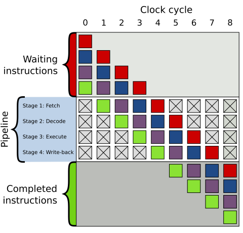
  - **Steady State:** when the pipeline is full and throughput is 1 instruction/cycle
- **Dependencies:**
  - one instruction relies on the results or resources of a previous one
  - **Structural:** two instructions in the pipeline need the same hardware at the exact same time  
    can be eliminated by duplicating hardware resources
  - **Data:** current instruction needs previous instruction to complete
    - **Read-after-Write:** true dependency on previous instruction's output value  
      *a.k.a.* true dependency
    - **Write-after-Read** & **Write-after-Write:** dependency on a register name only not on value due to limited num registers  
      exists due to lack of register IDs (*i.e.* names), *a.k.a.* false dependencies
    - 
      ```cpp
      // RAW
      r3 = r1 * r2;
      r5 = r3 + r4; // must wait for r3 to be computed

      // WAR
      r3 = r1 * r2;
      r1 = r4 + r5; // must not overwrite "r1" before it is read

      // WAW
      r3 = r1 * r2;
      r3 = r4 + r5; // must not overwrite "r3" till multiply done
      ```
  - **Control:** next instruction known only once branch is evaluated  
    *i.e.* data dependency on the instruction pointer (`IP`/`PC`)
- **Interlocking:**
  - detection of dependence between instructions to guarantee correct execution
  - **HW-based (Stall):** dependent instruction stalled (`NOP`s into next stage) until its source data is ready
  - **SW-based (Bubble):** compiler inserts `NOP`s to ensure stalled instruction waits
  - *example:* purple instruction delays execution  
    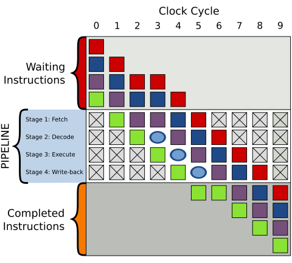
- **Data Forwarding/Bypassing:**
  - supply data directly from internal pipeline registers to the ALU, bypassing the register file
  - resolves most RAW dependencies without stalls (cannot solve use-after-`load` hazards)
- **Precise:** maintain consistent architectural state where all preceding instructions have retired/committed their results, and no subsequent instructions have modified the state (*i.e.* original program order)  
  **note:** required for exception handling, and useful for debugging

## Out-of-Order Execution
- to maximize throughput, independent instructions may overlap long-latency operations  
  but they precise architectural state must be maintained
- **Re-Order Buffer:**
  - instructions execute & complete out-of-order but results are buffered in ROB
  - results committed in-order (ROB → register file) when oldest instruction has completed without exceptions
  - 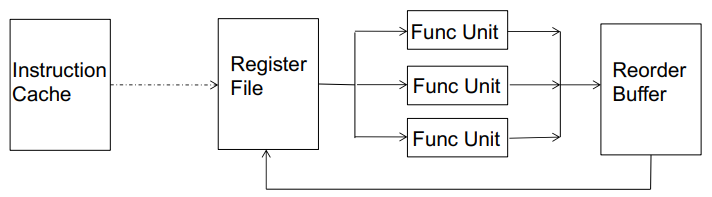
  - *example:* ROB execution for independent operations
    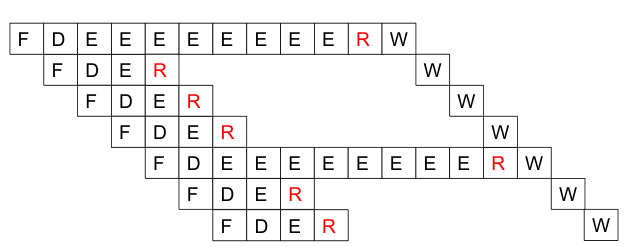
- **ROB with Data Dependencies:**
  - operands are sourced from register file, reorder buffer or directly via bypass path
  - **Register Renaming:** register mapped to ROB entry of (pending) instruction which will provide the data
  - instruction upon completion broadcasts its result to every instruction waiting for that ROB entry
  - since ROB (unlike register file) is not constrained by ISA, it can be very large, thus eliminating false (WAW & WAR) dependencies
  - true (RAW) dependency will still stall the in-order pipeline
- **Out-of-Order Execution:**
  - move dependent instructions out of the way of independent ones, ensuring true data dependency does not stall the entire processor
  - dependent instructions moved into rest areas (reservation stations), while monitoring their source values (or HW freeing up)
    instruction dispatched from rest areas when all source values are available
  - *i.e.* instructions dispatched in dataflow order, but not exposed to ISA
  - tolerates long-latency operations (like memory) by concurrently executing independent operations
  - *a.k.a.* dynamic instruction scheduling
- **Instruction/Scheduling Window:**
  - all decoded but not yet retired instructions
  - data-flow graph limited to this window is dynamically built
- ***Example:* Tomasulo's Algorithm:**
  - assign tag (register renaming) if dependency exists, else read value directly
  - buffer instruction (with tag and/or data values) to functional unit's RS
  - wait for data/resource dependencies to resolve, wakes up once its required tag is broadcasted
  - completed results & tags are broadcasted to all waiting RS entries and stored in ROB
  - register file only updated when instruction retires from ROB
  - 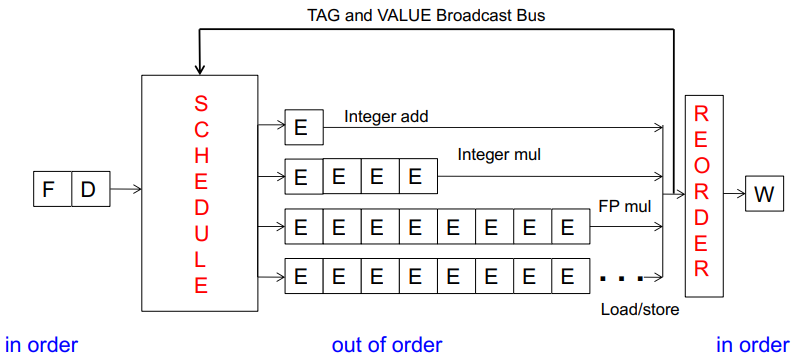
- **Memory Dependency Handling:**
  - memory address (& dependency) un-known until address computation is done
  - **Memory Disambiguation Problem:** challenge of determining whether two memory operations refer to the same physical address when they are executed out-of-order
  - approaches:
    - **Conservative:** load stalled till all prior stores are resolved
    - **Speculative:** load executes immediately assuming no conflict  
      but if store calculates same address, pipeline later flushed
  - **Store-to-Load Forwarding:** stores are buffered before committing to cache/memory, subsequent load can intercept data from store buffer direcly  
    *i.e.* data forwarding/bypassing of memory

## Superscalar Execution
- **Superscalar Execution:**
  - hardware automatically identifies & dispatches independent instructions to multiple execution units simultaneously
  - `N`-wide superscalar capable of sustaining peak thoughput of `N` IPC
  - superscalar & out-of-order execution are orthogonal concepts  
   *i.e.* can have all four combinations of processors: [in-order, out-of-order] x [scalar, superscalar]
- **Dependency Checking:**
  - hardware ensures that instructions fetched in the same cycle are independent of each other
  - OoO execution only has dependency checks across different pipeline stages  
    superscalar additionaly has checks between concurrent instructions in the same pipeline stage at the same time

## Very-Long Instruction Word
- **Very-Long Instruction Word (VLIW):**
  - multiple independent instructions packed/bundled together by the compiler
  - simple hardware which needs no dependency checking  
    compiler takes care of finding instruction level parallelism
  - execution of instructions in the bundle guaranteed to be atomic
  - recompilation required when execution width (`N`) or functional units change
- **Example: Qualcomm Hexagon DSP:**
  - each core can process 4 instructions concurrently
  - some VLIW slots are specialized, *example:* load/store only in first two slots
  - 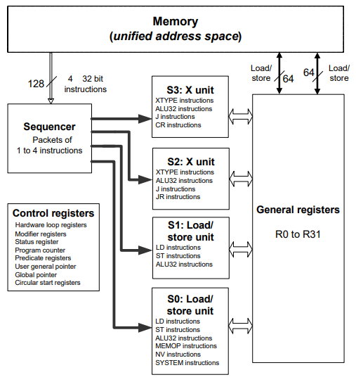

## Systolic Arrays
- **Systolic Array:**
  - grid of processing elements (nodes) that rhythmically compute and pass data
  - each node independently computes a partial result based on data received from its upstream neighbours, stores the result within itself and passes it downstream
  - maximizes computation done on a each piece of data brought from memory
  - 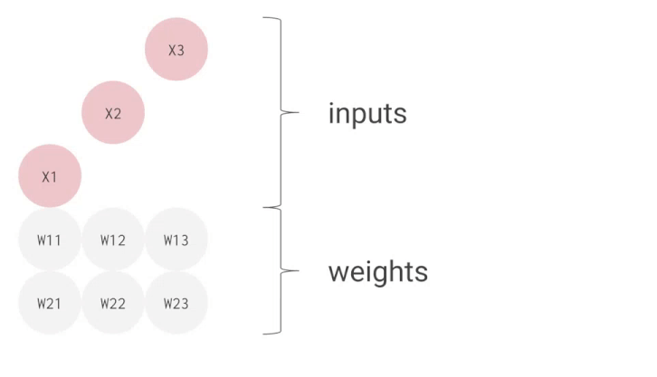
- **Example: Google Tensor Processing Units:**
  - fixed weights are pre-loaded into nodes, reducing power-hungry memory access
  - each node performs a multiply-accumulate every clock cycle
  - **Horizontal Move:** input data enters from the left, multiplied by the weight, and un-modified data passed to the right
  - **Vertical Accumulation:** multiplication results added to incoming partial sums from above, then passed downward
    *i.e.* `new_partial_sum = (input_data * fixed_weight) + partial_sum_from_above`
  - 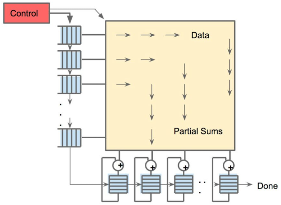

## Decoupled Access Execute
- **Decoupled Access Execute:**
  - decouple operand access from execution by (compiler) splitting them into two independent instruction streams  
    synchronization between two streams is only required when handling branch instructions
  - access unit: address calculation and data fetching from memory  
    execute unit: processing operands pulled from data queue
  - access stream typically runs ahead of the execute stream  
    *i.e.* pre-fetching data to hide memory latency
  - enables limited OoO execution with much simpler hardware
  - 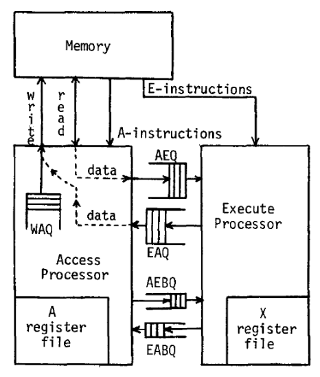

## Fine-Grained Multithreading
- **Fine-Grained Multithreading:**
  - fetch-engine fetches instruction from a different thread every cycle  
    *i.e.* no two instructions from a thread is the pipeline concurrently
  - hardware maintains multiple thread contexts (`PC` + registers)
  - tolerates dependency latencies by overlapping it with useful work from other threads
  - maximized throughput but degrades single thread performance (one instruction fetched every `N` cycles)
  - 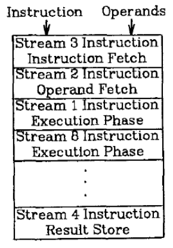

## Branch Prediction
- **Branch Problem:** next fetch-address unknown until control-flow instruction is resolved several cycles later in the pipeline
- **Branch Penalty:** number of speculatively executed instructions that must be discarded in case of branch mis-prediction
- **Branch Prediction:**
  - guess the direction of a branch and target address before the branch instruction is actually executed
  - **Static:**
    - guess is fixed at compile time
    - naive implementations like always not-taken and always taken
    - heuristics based implementations like profile (run) based and program (code) analysis based  
      *example:* `nullptr` check rarely true
  - **Dynamic:**
    - hardware guesses based on dynamic information collected at runtime
    - **1-Bit Predictor:**
      - guess branch will take same direction as its last instance
      - *example:* mispredicts last iteration for loop branches
    - **2-Bit Predictor:**
      - add hysteresis to one-bit predictor so that the prediction does not change on a single different outcome
      - *i.e.* needs 2 opposing outcomes to flip prediction direction
      - 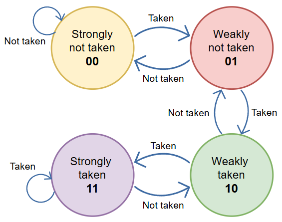
    - **Branch History Predictor:**
      - **Local:** strictly based on that specific instruction's past direction
      - **Global:** based on previous different branches' outcome assuming correlation  
        *example:* both conditions correlated
        ```cpp
        if (x < 1) { ... }
        if (x > 1) { ... }
        ```
      - 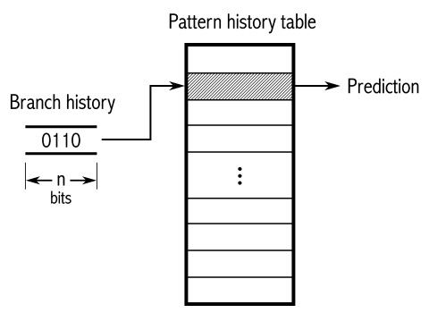
- **Delayed Branching:**
  - compiler inserts instructions executed regardless of branch direction immediately after control instruction
  - ```cpp
    // base
    ADDI R1, R1, 1;
    BEQ R2, R3, LABEL;
    NOP; // delay slot

    // optimized
    BEQ R2, R3, LABEL;
    ADDI R1, R1, 1; // moved to delay slot
    ```
- **Loop Un-Rolling:**
  - replicate loop body multiple times to increase work done per iteration
  - reduces loop control logic and increases instruction-level parallelism (more independent instructions)  
    increase in binary size which increases instruction cache misses
- **Predicated Execution:**
  - compiler converts control dependency to data dependency
  - instruction result committed only if predicate passes, else similar to `NOP`
  - *example:* remove branch using conditional move (`CMOV`)
    ```cpp
    if (a == 5) {
      b = 4;
    } else {
      b = 3;
    }

    CMPEQ condition, a, 5;
    CMOV condition, b, 4;
    CMOV !condition, b, 3;
    ```

## Parallel Computing
- **Parallel Computer:** collection of processing elements that cooperate to solve problems quickly
- **Fast != Efficient:**
  - just because program runs faster on parallel computer, doesn't mean its using the hardware efficiently
  - *example:* 2x speedup with 10 processors
  - achieving efficient processing almost always comes down to accessing data efficiently
- **Cache:**
  - on-chip storage that maintains a copy of a subset of values in memory
  - if address is "in cache", it can be loaded/stored more quickly that if it only resided in memory
- to prevent SIMD stall, add more execution contexts so more threads can run on same HW
- 1 (8-wide) instruction per clock, 1 thread at a time, but 100% utilization (some runnable thread always present)  
  but extra chip area, higher throughput at cost of higher per thread latency
- ratio of ALU cycles to MemOps cycles determines how much multi-threading to reach 100% utilization  
  example: 2 images
- example: Kaby Lake:
  - multiple fetch decode to stuff instr to all vector & scalar ALU blocks
- GPU: extreme throughput-oriented processors
  - streaming multi-processor (SM): equivalent to core
  - warp: execution contexts

[CONTINUE](https://youtu.be/F4bVSyz_jxo?list=PLoROMvodv4rMp7MTFr4hQsDEcX7Bx6Odp&t=1622)

## Misc
- **Meltdown & Spectre:**
  - speculative execution leaves traces of data in cache
  - malicious program can inspect cache contents to infer secret data
- **Rowhammer:**
  - repeatedly accessing a DRAM row enough times drains charge in adjacent rows
  - this electrical interference can be used to predictably induce bit flips
  - > it's like breaking into an apartment by repeatedly slamming a neighbor's door until vibrations open the door you were after

## Scratch
- **Time Division Multiplexing:** method of sharing a single resource (like core, bus) by assigning each task a fixed non-overlapping time-slot for exclusive access