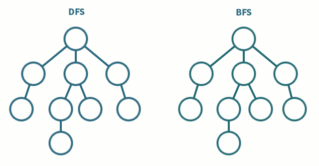

# DSA
- [Introduction](#introduction)
- [Big-O](#big-o)
- [Arrays](#arrays)
- [Hash Tables](#hash-tables)
- [Graphs](#graphs)
  - [Types](#types)
  - [Representation](#representation)
  - [Depth \& Breadth First Search](#depth--breadth-first-search)

## Links <!-- omit from toc -->
- [William Fiset Data Structures (Playlist)](https://www.youtube.com/playlist?list=PLDV1Zeh2NRsB6SWUrDFW2RmDotAfPbeHu)
- [Big-O Cheatsheet](https://www.bigocheatsheet.com/)
- [Why `log(n)`](https://www.youtube.com/watch?v=Xe9aq1WLpjU)

## To Do <!-- omit from toc -->
- Bloom Filter

## Introduction
- **Data Structures:** way of organizing data so that it can be used effectively
- **Abstract Data Type:**
  - provides only the interface to which a data structure must adhere to
  - *example:* queue abstraction can be implemented using LL, array or stack

## Big-O
- **Big-O/Asympotic Notation:**
  - upper bound of complexity (time & space) in the worst case
  - helps quantify performance as the input size becomes arbitrarily large (*i.e.* growth rate of complexity)
  - *example:* if running time given by `f(n) = 7*log(n)^3 + 15*n^2 + 2*n^3 + 8`, then `O(f(n)) = O(n^3)`
  - 
- **Logarithm:**
  - `ceil(log(n))` represe nts the minimum number of bits to uniquely identify a number
  - each step in search algo is essentially resolving 1bit of target's index, *i.e.*`O(log(n))`
  - each step in comparison sort algo is finding a correct index for each element in remaining positions  
    `log(n) + log(n-1) + ... + log(1)` = `O(log(n)) + O(log(n)) + ...` = `O(n*log(n))`
- ***Examples*:**
  - `f(n) = n/3` = `O(n)`
    ```cpp
    i = 0;
    while (i < n) {
      i = i + 3;
    }
    ```
  - inner loop executes `n`, `(n-1)` ... `1` times as `i` increases  
    total (*i.e.* sum of natural numbers) is `n*(n+1)/2` = `O(n^2)`
    ```cpp
    for (int i = 0; i < n; i++)
      for (int j = i; j < n; j++)
    ```
  - size halves every iteration `O(log(n))`
    ```cpp
    low = 0;
    high = n - 1;
    while (low <= high) {
      mid = (low + high) / 2;
      if (array[mid] == key)
        return mid;
      else if (array[mid] < value)
        low = mid + 1;
      else if (array[mid] > value)
        high = mid - 1;
    }
    return -1; // not found
    ```

## Arrays
- **Static Array:** fixed (compile-time) length container indexable for the range `[0, n-1]`
- **Dynamic Array:** can resize itself during runtime, resizing requires copying over existing elements
- **Dynamic Array Implementation:**
  - static array with initial size (capacity)
  - keep adding elements keeping tracking of size
  - when size == capacity, create new static array of double the capacity, copy elements over

## Hash Tables
- **Hash Table:** provides a mapping from keys to values using a technique called hashing
- **Hash Function:**
  - maps a key `x` to a whole number, which is used as index
  - 
    |                |                               |
    | -------------- | ----------------------------- |
    | `H(x) == H(y)` | `x` & `y` might be equal      |
    | `H(x) != H(y)` | `x` & `y` certainly not equal |
  - should be deterministic, *i.e.* same index for same key every time
  - should be uniform to minimize hash collisions
  - to be hashable key type should be immutable  
    *example:* lists/set can change in-place, rendering original index unreachable
- **Load Factor:** represents ratio of current size to total capacity of a hash table
- **Re-Hashing:** to maintain `O(1)` lookup, resize table (double *i.e.* exponential) and rehash keys once load factor hits a threshold
- **Hash Collisions:**
  - same hash value generated for two distinct keys
  - **Separate Chaining:**
    - each hash table bucket is a container that can hold multiple collided keys
    - collided keys appended to the container (usually LL)
    - `O(1 + a)`, where `a` is average LL length, as load factor grows `a ≈ n`, *i.e.* `O(n)`
  - **Open Addressing:**
    - search next available slot within the hash table array
    - next slot by offsetting current position to probing sequence function
    - 
      |                            |                                                       |
      | -------------------------- | ----------------------------------------------------- |
      | linear probing             | `P(i) = i`, sequential search for `i`th iteration     |
      | quadratic probing          | `P(i) = i^2`, search further & further away           |
      | double hashing             | `P(k, i) = i * H2(k)`, `H2()` secondary hash function |
      | pseuo-random num generator | `P(k, i) = RNG(H(k))[i]`, `RNG` seeded with `H(k)`    |
    - since probing sequence output used as offset, it should be non-zero
    - **Cycling:**
      - probing function hits same subset of indices repeatedly without checking every slot
      - instead use probing function that produce cycle of exactly table length
      - 
    - **Clustering:**
      - tendency for occupied slots to bunch together in contiguous groups
      - high load factor (~0.8) leads to high clustering, leading to higher search times
      - but linear probing can scan much faster (even at high load factors) due to high cache spatial locality
    - **Tombstones (Removing Element):**
      - elements searched till `NULL` encountered
      - replacing removed element with `NULL` leads to premature search stop
      - instead place unique tomstone marker that is skipped during search
      - tombstones increase load factor, so removed by resize or overwritten by insert
      - lazy relocation (optimization) moves a found key to the first encountered tombstone to shorten probe path for future lookups

## Graphs
- **Graph:** non-linear data structure consisting of nodes and edges that connect them  
  `(u,v)` used to represent from `u` to `v`

### Types
- **Undirected:** edges have no orientation, `(u,v) == (v,u)`  
  *example:* bidirectional roads connecting cities
  ```mermaid
  graph LR
    A --- B
    A --- C
    B --- D
    C --- D
    D --- E
    C --- E
  ```
- **Directed (Digraph):** edges have orientations  
  *example:* `u` bought gift for `v`
  ```mermaid
  graph LR
    A --> B
    B --> C
    A --> C
    C --> D
    D --> A
  ```
- **Weighted:** edges contain certain weight to represent arbitrary value (cost, distance, quantity)  
  `(u,v,w)` third param for weight
  ```mermaid
  graph LR
    A ---|7| B
    A ---|10| C
    B ---|8| D
    C ---|2| D
    B ---|3| E
  ```
- **Special:**
  - **Tree:** undirected graph with no cycles (*i.e.* `N` nodes with `N-1` edges)
    ```mermaid
    graph TD
      A --- B
      A --- C
      A --- D
      B --- E
      B --- F
      D --- G
    ```
  - **Rooted Trees:** tree with designated root node where every edge either points away (out-tree) or towards it (in-tree)
    ```mermaid
    graph TD
      A --> B
      A --> C
      B --> D
      B --> E
      C --> F
    ```
  - **Directed Acyclic Graphs (DAGs):** directed graphs with no cycles  
    used for representing structures with dependencies (in compiler, build systems)  
    **note:** all out-trees are DAGs, but vice-versa not true
    ```mermaid
    graph LR
      A --> B
      A --> C
      B --> D
      C --> D
      C --> E
      D --> F
      E --> F
    ```
  - **Bipartite:** vertices can be split into two independent groups `U` & `V` such that every edge connects between `U` & `V`  
    *a.k.a.* two colorable and no-odd-length cycle
    ```mermaid
    graph LR
      A --- B
      B --- C
      C --- D
      D --- E
      E --- F
      F --- C

    ```
    ```mermaid
    graph LR
      subgraph U
          direction TB
          A
          C
          E
      end
      subgraph V
          direction TB
          B
          D
          F
      end
      A --- B
      B --- C
      C --- D
      D --- E
      E --- F
      F --- C
    ```
  - **Complete:** there exists an unique edge between every pair of nodes (represented as `Kn`for `n` vertices)  
    *i.e.* each node has `n-1` connections
    ```mermaid
    graph LR
      A --- B
      A --- C
      A --- D
      A --- E
      B --- C
      B --- D
      B --- E
      C --- D
      C --- E
      D --- E
    ```

### Representation
- **Adjacency Matrix:** `m[i][j]` represents edge weight of going from node `i` → `j`  
  edge of going to itself is often assumed to be zero
  ```mermaid
  graph LR
    A -->|2| B
    A -->|5| C
    B -->|4| D
    C -->|2| D
    B -->|3| A
    D -->|3| B
    D -->|1| C
  ```
  ```
  [*  A  B  C  D]
  [A  0  2  5  0]
  [B  3  0  0  4]
  [C  0  0  0  2]
  [D  0  3  1  0]
  ```
  - **Pros:** space efficient for dense graphs, `O(1)` edge/weight lookup
  - **Cons:** `O(n^2)` space, iterating all edges takes `O(n^2)` (must scan even 0s)
- **Adjacency List:** map where keys are nodes and values are (edge, weight) pairs
  ```
  A -> [(B, 2), (C, 5)]
  B -> [(A, 3), (D, 4)]
  C -> [(D, 2)]
  D -> [(B, 3), (C, 1)]
  ```
  - **Pros:** space efficient for sparse graphs, iterating over all edges efficient
  - **Cons:** edge weight lookup `O(num_edges)` (for a key)
- **Edge List:** unordered list of edges (with weight)
  ```
  [(A, B, 2), (A, C, 5), (B, D, 4), (C, D, 2), (B, A, 3), (D, B, 3), (D, C, 1)]
  ```
  - **Pros:** space efficient for sparse graphs, iterating over all edges efficient
  - **Cons:** edge weight lookup `O(num_edges)`

### Depth & Breadth First Search
- 
- **Depth-First Search:**
  - start at a root node and explore as far as possible along each branch before backtracking
  - using a stack:
    - call stack (recursion):
      ```cpp
      visited(num_nodes) = {false};

      // start DFS from node zero
      start_node = 0;
      dfs(start_node);

      void dfs(at) {
        // base case (stop calling itself and start returning)
        if (visited[at])
          return;

        // marking & exploring
        visited[at] = true;
        neighbors = graph[at];

        // recursive step
        for (next : neighbors)
          dfs(next)
      }
      ```
    - explicit stack (iterative)
      ```cpp
      visited(num_nodes) = {false};
      stack();
      start_node = 0;

      dfs() {
        stack.push(start_node);

        while (stack.size()) {
          at = stack.pop();

          // skip already-visited nodes added by different neighbors
          // required in case un-visited (at that time) node was pushed to stack multiple times
          if (visited[at])
            continue;

          visited[at] = true;

          neighbors = graph[at];
          for (next : neighbors) {
            if (!visited[next]) { // smaller stack, else will hit "(visited[at])" anyway
              // push nodes to visit them later
              stack.push(next);
            }
          }
        }
      }
      ```
- ***Example:* Connected Components:**
  - maximal subset of nodes where each node is reachable from any other within that subset  
    *i.e.* mark/paint all reachable nodes as being part of same component
  - 
    ```mermaid
    graph TD
      subgraph Component_1 [ID: 1]
          0 --- 1
          1 --- 2
          2 --- 0
      end

      subgraph Component_2 [ID: 2]
          3 --- 4
      end

      subgraph Component_3 [ID: 3]
          5
      end
    ```
  - 
    ```cpp
    dfs(at, current_label) {
        if (visited[at])
            return;

        visited[at] = true;
        labels[at] = current_label; // paint with current label

        neighbors = graph[at];
        for (next : neighbors) {
            dfs(next, current_label);
        }
    }

    // iterate over every node
    for (i = 0; i < n; i++) {
        // visited/painted nodes skipped
        if (!visited[i]) {
            // increment to new label
            count++;
            // paint entire component with new label
            dfs(i, count);
        }
    }
    ```
- **Bread-First Search:**
  - start at a root node and explore all neighbor nodes first before moving to next level neighbors
  - **note:** `if (!visited[next])` is an optimization for DFS since it dives deep quickly
    but BFS explores in layers (without `visited` check) so queue can grow exponentially (`O(V^2) == O(E)` for dense graphs)
  - implementation uses a queue
    ```cpp
    visited(num_nodes) = {false};
    queue();
    start_node = 0;

    bfs(start_node) {
      visited[start_node] = true; // mark immediately when enqueued
      queue.push_back(start_node);

      while (queue.size()) {
        at = queue.pop_front();

        neighbors = graph[at];
        for (next : neighbors) {
          if (!visited[next]) {
            // mark as visited immediately when enqueued
            // to prevent adding same node multiple times
            visited[next] = true;
            queue.push_back(next);
          }
        }
      }
    }
    ```
- ***Example:* Shortest Path:**
  - find the shortest path between two nodes by leaving a trail of breadcrumbs
  - 
    ```cpp
    visited(num_nodes) = {false};
    parent(num_nodes) = {-1};
    queue();
    start_node = 0;

    bfs(start_node, target, parent) {
      visited[start_node] = true;
      queue.push_back(start_node);

      while (queue.size()) {
        at = queue.pop_front();

        // premature stop if target reached
        if (at == target)
          break;

        neighbors = graph[at];
        for (next : neighbors) {
          if (!visited[next]) {
            visited[next] = true;
            parent[next] = at; // set parent when node seen first time
            queue.push_back(next);
          }
        }
      }
    }

    reconstruct_path(start, target, parent) {
      path[];
      // start at the end and follow parents back to the start
      for (at = target; at != -1; at = parent[at]) {
        path.push_back(at);
      }

      reverse(path); // [target...start] → [start...target]

      // if first element != start, no path exists
      if (path[0] == start)
        return path;
      else
        return [];
    }
    ```

[CONTINUE](https://www.youtube.com/watch?v=KiCBXu4P-2Y&list=PLDV1Zeh2NRsDGO4--qE8yH72HFL1Km93P&index=6)