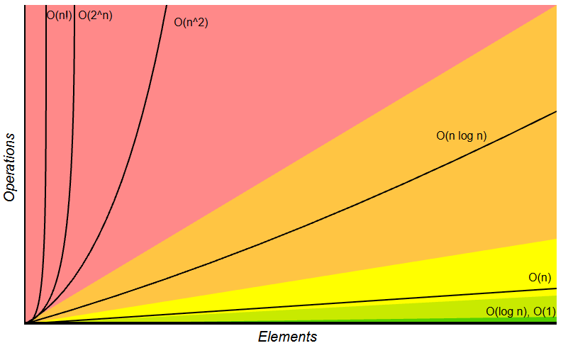
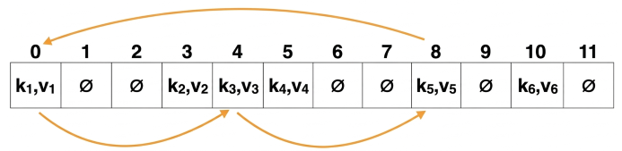
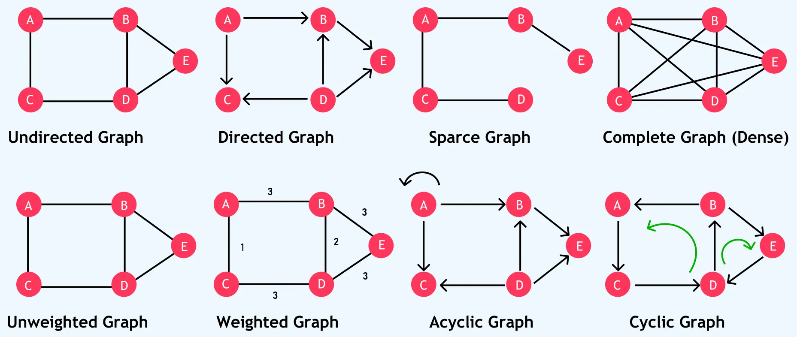
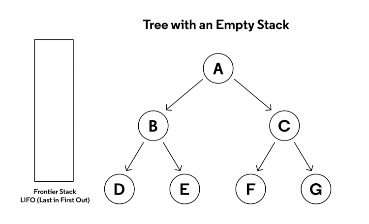
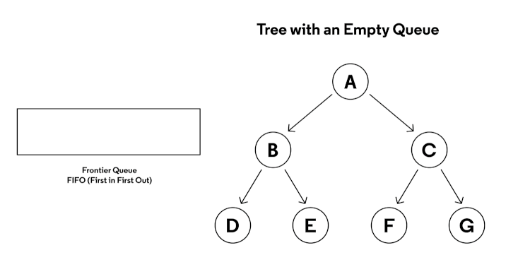

# DSA
- [Introduction](#introduction)
- [Big-O](#big-o)
- [Arrays](#arrays)
- [Hash Tables](#hash-tables)
- [Graphs](#graphs)
  - [Depth-First Search](#depth-first-search)
  - [Breadth-First Search](#breadth-first-search)

## Links <!-- omit from toc -->
- [William Fiset Data Structures (Playlist)](https://www.youtube.com/playlist?list=PLDV1Zeh2NRsB6SWUrDFW2RmDotAfPbeHu)
- [Big-O Cheatsheet](https://www.bigocheatsheet.com/)
- [Why `log(n)`](https://www.youtube.com/watch?v=Xe9aq1WLpjU)

## To Do <!-- omit from toc -->
- Bloom Filter

## Introduction
- **Data Structures:** way of organizing data so that it can be used effectively
- **Abstract Data Type:**
  - provides only the interface to which a data structure must adhere to
  - *example:* queue abstraction can be implemented using LL, array or stack

## Big-O
- **Big-O/Asympotic Notation:**
  - upper bound of complexity (time & space) in the worst case
  - helps quantify performance as the input size becomes arbitrarily large (*i.e.* growth rate of complexity)
  - *example:* if running time given by `f(n) = 7*log(n)^3 + 15*n^2 + 2*n^3 + 8`, then `O(f(n)) = O(n^3)`
  - 
- **Logarithm:**
  - `ceil(log(n))` represe nts the minimum number of bits to uniquely identify a number
  - each step in search algo is essentially resolving 1bit of target's index, *i.e.*`O(log(n))`
  - each step in comparison sort algo is finding a correct index for each element in remaining positions  
    `log(n) + log(n-1) + ... + log(1)` = `O(log(n)) + O(log(n)) + ...` = `O(n*log(n))`
- ***Examples*:**
  - `f(n) = n/3` = `O(n)`
    ```cpp
    i = 0;
    while (i < n) {
      i = i + 3;
    }
    ```
  - inner loop executes `n`, `(n-1)` ... `1` times as `i` increases  
    total (*i.e.* sum of natural numbers) is `n*(n+1)/2` = `O(n^2)`
    ```cpp
    for (int i = 0; i < n; i++)
      for (int j = i; j < n; j++)
    ```
  - size halves every iteration `O(log(n))`
    ```cpp
    low = 0;
    high = n - 1;
    while (low <= high) {
      mid = (low + high) / 2;
      if (array[mid] == key)
        return mid;
      else if (array[mid] < value)
        low = mid + 1;
      else if (array[mid] > value)
        high = mid - 1;
    }
    return -1; // not found
    ```

## Arrays
- **Static Array:** fixed (compile-time) length container indexable for the range `[0, n-1]`
- **Dynamic Array:** can resize itself during runtime, resizing requires copying over existing elements
- **Dynamic Array Implementation:**
  - static array with initial size (capacity)
  - keep adding elements keeping tracking of size
  - when size == capacity, create new static array of double the capacity, copy elements over

## Hash Tables
- **Hash Table:** provides a mapping from keys to values using a technique called hashing
- **Hash Function:**
  - maps a key `x` to a whole number, which is used as index
  - 
    |                |                               |
    | -------------- | ----------------------------- |
    | `H(x) == H(y)` | `x` & `y` might be equal      |
    | `H(x) != H(y)` | `x` & `y` certainly not equal |
  - should be deterministic, *i.e.* same index for same key every time
  - should be uniform to minimize hash collisions
  - to be hashable key type should be immutable  
    *example:* lists/set can change in-place, rendering original index unreachable
- **Load Factor:** represents ratio of current size to total capacity of a hash table
- **Re-Hashing:** to maintain `O(1)` lookup, resize table (double *i.e.* exponential) and rehash keys once load factor hits a threshold
- **Hash Collisions:**
  - same hash value generated for two distinct keys
  - **Separate Chaining:**
    - each hash table bucket is a container that can hold multiple collided keys
    - collided keys appended to the container (usually LL)
    - `O(1 + a)`, where `a` is average LL length, as load factor grows `a ≈ n`, *i.e.* `O(n)`
  - **Open Addressing:**
    - search next available slot within the hash table array
    - next slot by offsetting current position to probing sequence function
    - 
      |                            |                                                       |
      | -------------------------- | ----------------------------------------------------- |
      | linear probing             | `P(i) = i`, sequential search for `i`th iteration     |
      | quadratic probing          | `P(i) = i^2`, search further & further away           |
      | double hashing             | `P(k, i) = i * H2(k)`, `H2()` secondary hash function |
      | pseuo-random num generator | `P(k, i) = RNG(H(k))[i]`, `RNG` seeded with `H(k)`    |
    - since probing sequence output used as offset, it should be non-zero
    - **Cycling:**
      - probing function hits same subset of indices repeatedly without checking every slot
      - instead use probing function that produce cycle of exactly table length
      - 
    - **Clustering:**
      - tendency for occupied slots to bunch together in contiguous groups
      - high load factor (~0.8) leads to high clustering, leading to higher search times
      - but linear probing can scan much faster (even at high load factors) due to high cache spatial locality
    - **Tombstones (Removing Element):**
      - elements searched till `NULL` encountered
      - replacing removed element with `NULL` leads to premature search stop
      - instead place unique tomstone marker that is skipped during search
      - tombstones increase load factor, so removed by resize or overwritten by insert
      - lazy relocation (optimization) moves a found key to the first encountered tombstone to shorten probe path for future lookups

## Graphs
- **Graph:** non-linear data structure consisting of a finite set of vertices/nodes and the edges that connect them  
  `(u, v)` represents connection (edge) from `u` to `v`
- **Terminology:**
  - **Neighbor:** vertices connected by an edge
  - **Degree:** number of edges connected to a particular node
  - **Path:** sequence of vertices connected by edges  
    **Path Length:** number of edges in a path  
    *example:* 0 → 6 → 7 → 3 → 2 path has length 4
  - **Cycle:** path that starts & ends at the same vertex  
    *i.e.* all cycles are path, but not all paths are cycles
  - **Connectivity:** if a path exists between two vertices  
    **Connected Component:** subset of vertices that is connected
- **Types:**
  - 
  - **Undirected:** edges have no orientation, *i.e.* `(u,v) == (v,u)`  
    **Directed (Digraph):** edges are uni-directional  
    **Directed Acyclic Graphs (DAGs):** directed graphs with no cycles used to represent structures with dependencies (in compiler, build systems)
  - **Weighted:** edges contain certain weight to represent arbitrary value (cost, distance, quantity)  
  - **Tree:** has three properties
    - connected and acyclic
    - removing edge disconnects graph
    - adding edge creates a cycle
    - ```mermaid
      graph TD
        A --- B
        A --- C
        A --- D
        B --- E
        B --- F
        D --- G
      ```
- **Representation:**
  ```mermaid
  graph LR
    A -->|2| B
    A -->|5| C
    B -->|4| D
    C -->|2| D
    B -->|3| A
    D -->|3| B
    D -->|1| C
  ```
  - **Adjacency Matrix:** `m[i][j]` represents edge weight of going from node `i` → `j`  
    `O(n^2)` space & time (must even scan 0s), but edge weight lookup `O(1)`
    ```
    [*  A  B  C  D]
    [A  0  2  5  0]
    [B  3  0  0  4]
    [C  0  0  0  2]
    [D  0  3  1  0]
    ```
  - **Edge Set:** unordered list of edges (with weight as third param)  
    iterating over all edges and edge weight lookup `O(num_edges)`
    ```
    [(A, B, 2), (A, C, 5), (B, D, 4), (C, D, 2), (B, A, 3), (D, B, 3), (D, C, 1)]
    ```
  - **Adjacency List:** map each nodes to its neighbors
    iterating over all edges `O(num_edges)` but edge weight lookup `O(num_edges_for_node)`
    ```
    A -> [(B, 2), (C, 5)]
    B -> [(A, 3), (D, 4)]
    C -> [(D, 2)]
    D -> [(B, 3), (C, 1)]
    ```
- **Graph Traversal:** start at a vertex and visit every other (connected) vertex  
  `O(V+E)` time, `O(V)` for processing nodes/vertices themselves and `O(E)` for traversing edges looking for neighbors  
  `O(V^2)` for adjacency matrix

### Depth-First Search
- 
- **Depth-First Search:** explore as far as possible along each branch by visiting a node and then recursively visiting all of its neighbors before backtracking
- **Recursive DFS:** using call-stack, but can lead to stack overflow
  ```cpp
  visited(num_nodes) = {false};

  depthFirstSearch(node) {
    visited[node] = true; // mark node
    process(node);        // process node

    for (i : neighbors(node)) {
      if (!visited(i)) {
        depthFirstSearch(i); // explore un-visited nodes
      }
    }
  }

  dfs(0); // start from node zero
  ```
- **Iterative DFS:** using explicit stack data structure
  ```cpp
  visited(num_nodes) = {false};
  stack();

  depthFirstSearch() {
    stack.push(0); // start from node zero

    while (stack.size()) {
      node = stack.pop();
      if !(visited(node)) {   // required for correctness (EXPLAINED BELOW)
        visited[node] = true;
        process(node);

        for (i : neighbors(node)) {
          if (!visited(i)) {  // just an optimization
            stack.push(i); // push un-visited nodes
          }
        }
      }
    }
  }
  ```
  - **Why Check Visited After `pop()`?:**
    - in recursion, neighbors immediately visited so duplicates not added to stack
    - in iteration, two nodes with common neighbor will push duplicate nodes to stack  
      **note:** visited check before `push()` optimization to prevent useless `pop()`
- **Post-Order DFS Traversal:** process node only once all neighbor nodes done processing  
  one-line change of moving `process(node)` to the bottom
  ```cpp
  depthFirstSearch(node) {
    visited[node] = true;

    for (i : neighbors(node)) {
      if (!visited(i)) {
        depthFirstSearch(i);
      }
    }

    process(node); // process node once all neighbors done
  }
  ```
- ***Examples:***
  - **Cycle Detection:** any new edge pointing to already visited node
  - **Connected Components:** mark/paint all reachable nodes as being part of same component  
    **note:** will have to visit all clusters
    ```cpp
    for (int i = 0; i < num_nodes; i++) {
      if (!visited[i]) {
        paint++;
        depthFirstSearch(i, paint);
      }
    }
    ```
  - **Topological Sort:** turn DAG into linear ordering such that each node is processed only after all its dependencies are visited  
    DFS post-order outputs what finished last (dependencies done) to what finished first (leaf node)  
    *i.e.* reverse DFS post-order works as topological sort
    ```cpp
    depthFirstSearch(node) {
      visited[node] = true;

      for (i : neighbors(node)) {
        if (!visited(i)) {
          depthFirstSearch(i);
        }
      }

      deque.pushfront(node); // what finished earlier pushed to start
    }
    ```

### Breadth-First Search
- 
- **Breadth-First Search:** explores all neighbors at the present depth (*i.e.* distance from root) before moving on to the nodes at the next depth level (*i.e.* exploring in waves)
- **Iterative BFS:** using explicit queue  
  **note:** code similar to iterative DFS will be correct but space inefficient
  ```cpp
  visited(num_nodes) = {false};

  breadthFirstSearch() {
    queue.push_front(0);
    visited[0] = true; // mark visited immediately when added to queue (EXPLAINED BELOW)

    while (queue.size()) {
      node = queue.pop_back();
      process(node);

      for (i : neighbors(node)) {
        if (!visited[i]) {
          queue.push_front(i); // en-queue un-visited nodes for next "wave"
          visited[i] = true;
        }
      }
    }
  }
  ```
  - **Why Mark Visited Immediately After `enqueue()`?:** multiple nodes in same wave will add common neighbor node from next level, causing queue to grow exponentially for complete graphs
- ***Examples:***
  - **Flood Fill:** fill all pixels 4-connected to starting pixel with a new pixel value  
    *i.e.* BFS then fill connected components  
    can also use DFS but BFS more intuitive
  - **Shortest Path:** shortest path between two nodes by leaving a trail of breadcrumbs (parent) then reconstruct the path using it

[CONTINUE](https://www.youtube.com/watch?v=KiCBXu4P-2Y&list=PLDV1Zeh2NRsDGO4--qE8yH72HFL1Km93P&index=6)