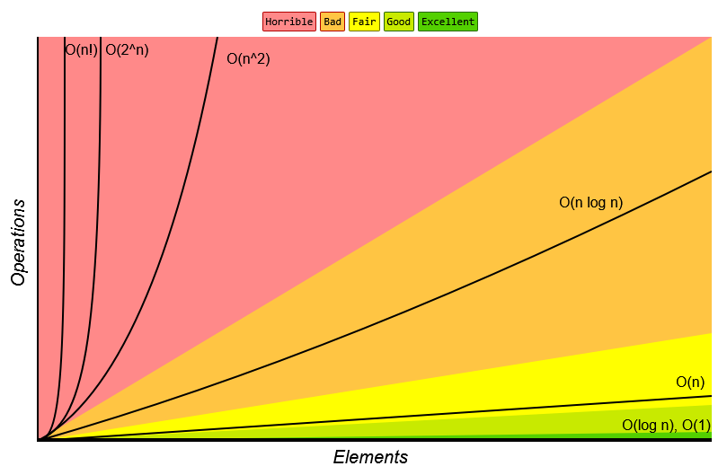

# Complexity
- [Introduction](#introduction)
- [Big-O](#big-o)
- [Logarithm](#logarithm)
- [Examples](#examples)
- [TODO (AI OUTPUT)](#todo-ai-output)

## Links <!-- omit from toc -->
- [William Fiset Data Structures (Playlist)](https://www.youtube.com/playlist?list=PLDV1Zeh2NRsB6SWUrDFW2RmDotAfPbeHu)
- [Big-O Cheatsheet](https://www.bigocheatsheet.com/)
- [Why `log(n)`](https://www.youtube.com/watch?v=Xe9aq1WLpjU)

## Introduction
- **Data Structures:** way of organizing data so that it can be used effectively
- **Abstract Data Type:**
  - provides only the interface to which a data structure must adhere to
  - *example:* queue abstraction can be implemented using LL, array or stack

## Big-O
- upper bound of complexity (time & space) in the worst case
- quantifies how execution time/space scales as input becomes arbitrarily large
- *example:* if running time given by `f(n) = 7*log(n)^3 + 15*n^2 + 2*n^3 + 8`, then `O(f(n)) = O(n^3)`
- 

## Logarithm
- *example:* `291 = 2x10^2 + 9*10^1 + 1*10^0` is bounded by `10^3`, `10^3 > 291` ⇒ `3 > log10(291)`  
  so `ceil(log10(VALUE))` represents num digits required to uniquely identify `[0, VALUE-1]`   
  similarly binary representation need `ceil(log2(VALUE))` bits
- each step in search algorithm is essentially resolving 1bit of target's index ⇒ `O(log(n))`
- each step in comparison sort algorithm is finding a correct index for each element in remaining positions  
  `log(n) + log(n-1) + ... + log(1)` ≈ `O(log(n)) + O(log(n)) + ...` ⇒ `O(n*log(n))`

## Examples
- `f(n) = n/3` ⇒ `O(n)`
  ```cpp
  i = 0;
  while (i < n) {
    i = i + 3;
  }
  ```
- inner loop executes { `n`, `(n-1)`, ... `2`, `1` } times as `i` increases  
  total is sum of natural numbers `f(n) = n*(n+1)/2` ⇒ `O(n^2)`
  ```cpp
  for (int i = 0; i < n; i++)
    for (int j = i; j < n; j++)
  ```
- `f(n) = n * (3*n + 2*n)` ⇒ `O(n^2)`
  ```cpp
  i = 0;
  while (i < n) {
      j = 0;
      while (j < 3 * n)
          j = j + 1;
      j = 0;
      while (j < 2 * n)
          j = j + 1;
      i = i + 1;
  }
  ```
- `f(n) = 3*n * (40 + n*n*n/2)` ⇒ `O(n^4)`
  ```cpp
  i = 0;
  while (i < n) {
      j = 10;
      while (j <= 50)
          j = j + 1;
      j = 0;
      while (j < n * n * n)
          j = j + 2;
      i = i + 1;
  }
  ```
- size halves every iteration ⇒ `O(log2(n))`
  ```cpp
  low = 0;
  high = n - 1;
  while (low <= high) {
    mid = (low + high) / 2;
    if (array[mid] == key)
      return mid;
    else if (array[mid] < value)
      low = mid + 1;
    else if (array[mid] > value)
      high = mid - 1;
  }
  return -1; // not found
  ```

## TODO (AI OUTPUT)
### 1. The Asymptotic Family (Θ and Ω) & The Big-O           
  Misconception

  Your notes currently state Big-O is the "worst case upper
  bound".

  • Misconception: Big-O is not synonymous with worst-case.
  Big-O is mathematically an upper bound for any case (best,
  average, or worst).
  • The 3 Notations:
   | Notati…  | Mathematical … | Plain English… | Example (Linea… |
   | -------- | -------------- | -------------- | --------------- |
   | O(g(n))  | f(n) ≤ c ·     | Upper bound    | Best: O(1),     |
   | g(n)     | (grows no      | Worst: O(n)    |
   |          | faster than)   | (both valid)   |
   | Ω(g(n))  | f(n) ≥ c ·     | Lower bound    | Worst: Ω(n),    |
   | g(n)     | (grows at      | Best: Ω(1)     |
   |          | least as fast  |
   |          | as)            |
   | Θ(g(n))  | c₁g(n) ≤ f(n)  | Tight bound    | Worst: Θ(n),    |
   | ≤ c₂g(n) | (sandwiched    | Best: Θ(1)     |
   |          | from above and |
   |          | below)         |


  │ NOTE: In casual interview speech, people say "Big-O" when
  │ they technically mean Θ (the tight bound).
  ──────
  ### 2. Amortized Analysis (Crucial for Fiset & NeetCode)

  Used when an occasional expensive operation (O(n)) is paid
  for by many cheap operations (O(1)).

  • Distinct from Average Case: Average case assumes a
  probability distribution over inputs. Amortized guarantees
  worst-case average over a sequence of operations.
  • Classic Example (Dynamic Array Resizing):
      • Appending N elements into an array that doubles:
      • Copies happen at sizes 1, 2, 4, 8, …, N.
      • Total copy operations = 1 + 2 + 4 + … + N = 2N - 1.
      • Total cost for N inserts = N (inserts) + 2N (copies) ≈
      3N ⇒ 𝐎(𝟏) amortized per insert.
  • Key Data Structures with Amortized bounds:
      • Dynamic Array append ⇒ O(1)
      • Hash Table insertion with re-hashing ⇒ O(1)
      • Monotonic Stack (each element pushed once, popped at
      most once over whole loop) ⇒ O(n) total, O(1) amortized
      per element
      • Disjoint Set (Union-Find with path compression + rank)
      ⇒ O(α(n)) (Inverse Ackermann function)

  ──────
  ### 3. Auxiliary Space vs. Call Stack Space

  Your file defines space complexity briefly, but missing the
  distinction between Auxiliary Space and Input Space:

  • Auxiliary Space: Extra temporary space allocated by the
  algorithm (excluding inputs).
  • Recursion Stack Space: Proportional to the maximum call
  depth of the recursion tree, not the total number of calls:
      • Balanced Binary Tree DFS ⇒ max depth h = log₂(n) ⇒
      O(log n) stack space.
      • Skewed Tree / Linked List DFS ⇒ max depth n ⇒ O(n)
      stack space.

  ──────
  ### 4. Recurrence Relations & Master Theorem (Divide &       
  Conquer)

  William Fiset and tree algorithms rely heavily on divide-and-
  conquer recurrences:

    T(n) = a · T(n/b) + f(n)

  where a is number of subproblems, b is shrinkage factor, and
  f(n) is work done at current level.

   | Recurrence              | Big-Θ                | Classic Example      |
   | ----------------------- | -------------------- | -------------------- |
   | T(n) = T(n/2) + O(1)    | Θ(log                | Binary Search        |
   | n)                      |
   | T(n) = 2T(n/2) + O(1)   | Θ(n)                 | Full Tree Traversal  |
   |                         | (visits all n nodes) |
   | T(n) = 2T(n/2) + O(n)   | Θ(n log              | Merge Sort           |
   | n)                      |
   | T(n) = T(n - 1) + O(1)  | Θ(n)                 | Linear scan / single |
   |                         | recursion            |
   | T(n) = 2T(n - 1) + O(1) | Θ(2ⁿ)                | Naive Fibonacci /    |
   |                         | Subset generation    |

  • Branching Tree Formula: For recursive backtracking without
  memoization, time complexity is:

     ⎛ 𝐝⎞
    𝐎⎝𝐛 ⎠

  (where b = branching factor per node, d = maximum recursion
  depth).
  ──────
  ### 5. The "10⁸ Ops/Sec" Rule (LeetCode Constraint Sizing)

  A standard reference to instantly deduce the required time
  complexity from problem constraints:

  Modern CPUs perform ≈ 10⁸ operations per second. If the time
  limit is 1.0s:

   | Input Size N  | Target Time …              | Typical Algorithm         |
   | ------------- | -------------------------- | ------------------------- |
   | N ≤ 10        | O(n!)                      | Permutations, Travelling  |
   |               | Salesman (brute force)     |
   | N ≤ 20        | O(2ⁿ)                      | Backtracking, Subsets, DP |
   |               | with bitmasks              |
   | N ≤ 500       | O(n³)                      | Floyd-Warshall, Matrix    |
   |               | multiplication             |
   | N ≤ 5, 000    | O(n²)                      | Bubble/Insertion sort, 2D |
   |               | DP, all pairs              |
   | N ≤ 10⁵ - 10⁶ | O(n log n) or              | Sorting, Heaps, Sliding   |
   | O(n)          | Window, Two Pointers,      |
   |               | Monotonic Stack            |
   | N ≥ 10⁹       | O(log n) or                | Binary Search, Bitwise    |
   | O(1)          | tricks, GCD, Math formulas |